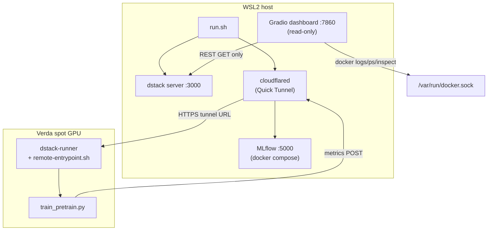

# remote-access

End-to-end stack for running [minimind](https://github.com/jingyaogong/minimind) pretraining on Verda spot GPUs (via dstack), with live MLflow metrics streaming through a Cloudflare Quick Tunnel, and a read-only Gradio dashboard for monitoring.

## TL;DR

```
./run.sh setup          # preflight + dstack config (once per machine)
./run.sh remote         # build image, start tunnel, submit dstack task
./run.sh dashboard up   # start Gradio dashboard at http://localhost:7860
./run.sh teardown       # kill tunnel, stop tracked runs
```

---

## Audience routing

| You are... | Start here |
|---|---|
| **New contributor** | This README → relevant subsystem README |
| **Operator / security reviewer** | [Security Posture](#security-posture) + [Current deployment values](#current-deployment-values) + [TROUBLESHOOTING.md](./TROUBLESHOOTING.md) |

---

## Architecture overview



**Data flows:**

1. `run.sh remote` builds `Dockerfile.remote`, pushes to GHCR/VCR, opens a CF Quick Tunnel, then calls `dstack apply` to submit the task.
2. The Verda worker pulls the image, downloads the dataset from HF, and runs `train_pretrain.py`.
3. `train_pretrain.py` POSTs metrics to MLflow via the tunnel URL (`MLFLOW_TRACKING_URI`).
4. The Gradio dashboard polls dstack REST (read-only: `runs/list`, `runs/get_plan`, `runs/get_logs`) and tails local Docker logs.

---

## Prerequisites

### Local (all modes)

| Requirement | Check |
|---|---|
| WSL2 with CUDA | `nvidia-smi` exits 0 |
| Windows NVIDIA driver ≥ 527.x | check Device Manager |
| nvidia-container-toolkit | `docker info \| grep nvidia` shows `nvidia` runtime |
| Project on ext4 (not `/mnt/c`) | `df -T . \| grep ext4` |
| Docker with Compose v2 | `docker compose version` |
| systemd enabled in WSL2 (recommended) | `/etc/wsl.conf` contains `systemd=true` |

Verify GPU access:
```bash
nvidia-smi
docker run --rm --gpus all nvidia/cuda:12.4.1-runtime-ubuntu22.04 nvidia-smi
```

### Remote training (additional)

| Requirement | Install |
|---|---|
| **dstack** | `uv venv ~/.dstack-cli-venv && uv pip install --python ~/.dstack-cli-venv/bin/python 'dstack[verda]'` |
| **cloudflared** | `curl -L https://github.com/cloudflare/cloudflared/releases/latest/download/cloudflared-linux-amd64 -o /usr/local/bin/cloudflared && chmod +x /usr/local/bin/cloudflared` |
| **GitHub PAT** (write:packages) | [github.com/settings/tokens](https://github.com/settings/tokens) — classic token; if SSO org, click "Authorize" after creation |
| **HF token** (dataset read) | [huggingface.co/settings/tokens](https://huggingface.co/settings/tokens) |
| **rsync** | `sudo apt install rsync` |

**dstack install note:** Install dstack in an isolated venv, not system Python. dstack 0.18–0.20 pins pydantic v1; system Python likely has pydantic v2 which causes `ValidationError` on startup. See [TROUBLESHOOTING.md §1](./TROUBLESHOOTING.md#1-dstack-pydantic-validation-conflict).

---

## Quickstart: local training

```bash
# 1. Parse credentials from ./secrets
./scripts/parse-secrets.sh

# 2. Preflight checks (WSL2 + GPU + file permissions)
make preflight

# 3. Start MLflow stack
docker compose -f training/mlflow-stack/docker-compose.mlflow.yml up -d
curl http://localhost:5000/health   # must return OK

# 4. Download dataset (~1.2 GB, requires hf_token)
bash training/setup-minimind.sh

# 5. Run training locally (10-min time cap)
./run.sh local

# 6. Verify health (local emulator)
curl http://localhost:8000/health
```

Local trainer writes checkpoints to `data/minimind-out/pretrain_768.pth`.
MLflow UI at http://localhost:5000 — experiment `minimind-pretrain`.

---

## Quickstart: remote training on Verda

```bash
# 1. Populate credential files (once per machine)
echo "ghp_YOUR_TOKEN" > gh_token && chmod 600 gh_token
echo "hf_YOUR_TOKEN"  > hf_token && chmod 600 hf_token
# ./secrets already present from local setup

# 2. Setup (preflight + dstack config) — once per machine
./run.sh setup

# 3. Start MLflow stack
docker compose -f training/mlflow-stack/docker-compose.mlflow.yml up -d
curl http://localhost:5000/health   # must return OK

# 4. Launch remote training
./run.sh remote

# Optional flags:
./run.sh remote --pull-artifacts   # rsync checkpoints after run completes
./run.sh remote --skip-build       # skip image rebuild (use existing :latest)
./run.sh remote --dry-run          # print pipeline without executing

# 5. Monitor via dashboard (separate terminal)
export DSTACK_SERVER_ADMIN_TOKEN="your-admin-token"
./run.sh dashboard up

# 6. Teardown
./run.sh teardown
```

See [training/README.md](./training/README.md) for the full pipeline sequence diagram and file-by-file reference.

---

## Quickstart: dashboard only

```bash
# Requires dstack server running and DSTACK_SERVER_ADMIN_TOKEN set
export DSTACK_SERVER_ADMIN_TOKEN="your-token"
./run.sh dashboard up
# Dashboard at http://localhost:7860

./run.sh dashboard logs   # tail container logs
./run.sh dashboard down   # stop
```

See [dashboard/README.md](./dashboard/README.md) for architecture, security controls, and test roster.

---

## Compose variants (local emulator)

| Target | Compose files | GPU | Use case |
|---|---|---|---|
| `make run` | `docker-compose.yml` | required | Default GPU mode |
| `make cpu` | `docker-compose.yml` + `docker-compose.cpu.yml` | none | CPU-only dev; `ALLOW_DEGRADED=1` |
| `make nvcr` | `docker-compose.yml` + `docker-compose.nvcr.yml` | required | NGC PyTorch base (~8GB vs ~3GB) |

Other Make targets:
```bash
make logs        # tail container logs
make shell       # exec into container
make smoke       # full fidelity probe suite (Probes A-F) + leak scan
make clean       # stop containers + clear data/ (preserves .placeholder)
make env         # re-run parse-secrets.sh
make preflight   # run scripts/preflight.sh
```

---

## Directory map

```
remote-access/
├── run.sh                          # top-level subcommand launcher
├── Makefile                        # local convenience targets
├── Dockerfile                      # local emulator image (verda-local)
├── docker-compose.yml              # GPU mode (default)
├── docker-compose.cpu.yml          # CPU degraded overlay
├── docker-compose.nvcr.yml         # NGC PyTorch base overlay
├── secrets                         # Verda ClientID + Secret (gitignored, mode 600)
├── gh_token                        # GitHub PAT write:packages (gitignored, mode 600)
├── hf_token                        # Hugging Face token (gitignored, mode 600)
├── .env.inference                  # local-dev VERDA_INFERENCE_TOKEN (generated, mode 600)
├── .env.mgmt                       # VERDA_CLIENT_ID + SECRET (generated, mode 600)
├── scripts/
│   ├── preflight.sh                # WSL2 + GPU + remote credential checks
│   ├── parse-secrets.sh            # parse ./secrets → .env.inference + .env.mgmt
│   ├── smoke.sh                    # full fidelity probe suite (Probes A-F)
│   ├── leak_scan.sh                # scan image layers for secret leakage
│   └── doc-anchor-check.sh         # verify README anchors resolve to source
├── app/
│   ├── main.py                     # FastAPI local emulator app
│   ├── gpu_probe.py                # GPU detection + degraded mode logic
│   └── start.sh                    # container entrypoint
├── training/
│   ├── README.md                   # training pipeline reference (this file's companion)
│   ├── Dockerfile.remote           # remote image (pytorch 2.4.1 + cuda 12.4)
│   ├── Dockerfile.train            # local training image
│   ├── build-and-push.sh           # build + push to GHCR
│   ├── remote-entrypoint.sh        # runs inside Verda container
│   ├── run-train.sh                # local training wrapper
│   ├── setup-minimind.sh           # minimind submodule setup + dataset download
│   ├── requirements.train.txt      # pip requirements for training image
│   ├── lib/
│   │   └── jq-fallback.sh          # portable JSON helper (jq or python3)
│   ├── patches/
│   │   └── minimind-atomic-save.patch  # atomic checkpoint + SIGTERM handler
│   ├── mlflow-stack/
│   │   ├── README.md               # MLflow compose stack reference
│   │   ├── Dockerfile.mlflow       # gunicorn + mlflow
│   │   ├── docker-compose.mlflow.yml
│   │   ├── docker-compose.train.mlflow.yml  # training overlay
│   │   ├── run-tunnel.sh           # CF Quick Tunnel bootstrap
│   │   └── patches/
│   │       ├── _mlflow_helper.py   # MLflow integration module
│   │       ├── apply.sh            # idempotent patch applier
│   │       └── train_pretrain.mlflow.patch
│   └── tests/
│       ├── conftest.py             # trainer_stub fixture
│       └── test_sigterm.py         # atomic-save + SIGTERM validation (5 cases)
├── dstack/
│   ├── README.md                   # dstack config + fleet + task reference
│   ├── pretrain.dstack.yml         # dstack task for H100/A100 spot
│   ├── fleet.dstack.yml            # spot fleet config (0-2 nodes)
│   └── setup-config.sh             # write ~/.dstack/server/config.yml
├── dashboard/
│   ├── README.md                   # dashboard architecture + security
│   ├── Dockerfile                  # dashboard container image
│   ├── docker-compose.dashboard.yml
│   ├── entrypoint.sh               # config gen + exec
│   ├── requirements.txt
│   └── src/
│       ├── app.py                  # Gradio Blocks + gr.Timer wiring
│       ├── state.py                # AppState dataclass + singleton
│       ├── bootstrap.py            # C2.2/C2.1 access-path gate
│       ├── safe_exec.py            # ONLY docker/dstack call path (allowlists)
│       ├── collector_workers.py    # CollectorWorker threads (2s/5s/10s/30s)
│       ├── log_tailer.py           # live log tailing (docker + dstack stream)
│       ├── ring_buffer.py          # bounded deque with monotonic seq
│       ├── redact.py               # secret env var redaction from log lines
│       ├── errors.py               # SourceStatus enum
│       ├── config.py               # config constants
│       ├── collectors/             # one module per data source
│       └── panels/                 # one module per UI panel (pure readers)
├── minimind/                       # git submodule — jingyaogong/minimind
├── data/                           # local dataset + checkpoint output
├── artifacts-pull/                 # rsync'd remote checkpoints (by run name)
├── PARITY.md                       # Verda documented vs local measured
├── TROUBLESHOOTING.md              # symptom/root-cause/fix matrix
└── README.md                       # this file
```

---

## Environment variables

### Core / cross-subsystem

| Variable | Default | Subsystem | Description |
|---|---|---|---|
| `DSTACK_SERVER_ADMIN_TOKEN` | required | dstack, dashboard | Admin token for dstack server REST API |
| `DSTACK_SERVER_URL` | `http://localhost:3000` | dstack, dashboard | dstack server URL (host-side) |
| `DSTACK_PROJECT` | `main` | dstack, dashboard | dstack project name |
| `DSTACK_TOKEN` | — | dashboard entrypoint | Token written to `/tmp/.dstack/config.yml` by entrypoint.sh |
| `DSTACK_SERVER` | `http://host.docker.internal:3000` | dashboard entrypoint | Server URL for CLI config (inside container) |

### Training / remote

| Variable | Default | Description |
|---|---|---|
| `HF_TOKEN` | required | Hugging Face token for dataset download from HF Hub |
| `GH_TOKEN` | required | GitHub PAT (`write:packages`) for GHCR image push |
| `SSH_PUBKEY` | `""` | WSL2 SSH pubkey baked into `Dockerfile.remote` at build time via ARG |
| `MLFLOW_TRACKING_URI` | — | CF Quick Tunnel URL; injected by `run.sh remote` from `.cf-tunnel.url` |
| `MLFLOW_EXPERIMENT_NAME` | `minimind-pretrain-remote` | MLflow experiment name for remote runs (`minimind-pretrain` for local) |
| `MLFLOW_ARTIFACT_UPLOAD` | `0` | Set `1` to upload checkpoints via MLflow artifact API |
| `MLFLOW_ENABLE_SYSTEM_METRICS_LOGGING` | `true` (overlay) | GPU/CPU/RAM system metrics captured every 5s |
| `MLFLOW_HTTP_REQUEST_MAX_RETRIES` | `7` (overlay) | Client retries for transient network errors |
| `VERDA_PROFILE` | `remote` | Tags MLflow run as `remote` vs `local` |
| `OUT_DIR` | `/workspace/out` | Checkpoint output directory inside remote container |
| `HF_DATASET_REPO` | `jingyaogong/minimind_dataset` | HF dataset repo ID |
| `HF_DATASET_FILENAME` | `pretrain_t2t_mini.jsonl` | Dataset filename within repo (~1.2 GB) |

### Image / registry

| Variable | Default | Description |
|---|---|---|
| `IMAGE_SHA` | git short HEAD | Tag component: `vccr.io/.../verda-minimind:<sha>` |
| `VCR_USERNAME` | — | Verda Container Registry username (contains `+`) |
| `VCR_PASSWORD` | — | Verda Container Registry password |
| `GH_USER` | resolved via API | GitHub username; cached to `.omc/state/gh_user.cache` |

### Local container (emulator)

| Variable | Default | Description |
|---|---|---|
| `VERDA_REQUIRE_GPU` | `1` | Require GPU; `/health` returns 503 without GPU unless `ALLOW_DEGRADED=1` |
| `ALLOW_DEGRADED` | unset | Set `1` for CPU-only; `/health` returns 200 with `X-GPU-Fidelity: degraded` |
| `WAIT_DATA_TIMEOUT` | `30` | Seconds to wait for `/data` to be writable before fatal exit |
| `APP_PORT` | `8000` | Port exposed by local emulator container |
| `VERDA_PULL_MODEL` | unset | If set, logged as model prefetch stub |
| `VERDA_INFERENCE_TOKEN` | (generated) | Local-dev bearer token for `/infer`; NOT a Verda-issued token |
| `VERDA_CLIENT_ID` | (parsed) | Verda management API client ID (from `./secrets`) |
| `VERDA_CLIENT_SECRET` | (parsed) | Verda management API client secret (from `./secrets`) |

### Dashboard

| Variable | Default | Description |
|---|---|---|
| `TRAINER_CONTAINER` | `minimind-trainer` | Docker container name to tail for logs |
| `MLFLOW_URL` | `http://mlflow:5000` | MLflow URL inside compose network |
| `REMOTE_RUN_NAME` | — | dstack run name for remote log following fallback |

---

## Security posture

| Exposure | Status | Rationale / Fix |
|---|---|---|
| 1. Plaintext `./secrets` file on disk | `accepted-debt` | Local-only; chmod 600; gitignored; non-prod. Migrate to sops/age for team use. |
| 2. `./gh_token` file permissions | `mitigated` | chmod 600 enforced by `preflight.sh`; not passed to container env. |
| 3. Dashboard mounts `/var/run/docker.sock` | `accepted-debt` | `:ro` flag is cosmetic — socket access is root-equivalent. Real enforcement is argv-whitelist in `safe_exec.py`. Follow-up F1: docker-socket-proxy. |
| 4. `SSH_PUBKEY` baked into image layer | `mitigated-but-private-registry-only` | Layer private while registry is private. Do NOT push to a public registry without rotating the pubkey first. |
| 5. `DSTACK_SERVER_ADMIN_TOKEN` in compose `environment:` | `accepted-debt` | Leaks via `docker inspect`. Local-only; swap to secret file for multi-user host. |
| 6. CF Quick Tunnel URL is unauthenticated and rotates on restart | `accepted-debt` | Demo-grade; ephemeral URL not guessable in practice. Swap to named tunnel for durable/production use. |
| 7. No cloudflared reconnect strategy | `accepted-debt` | Manual re-run required if tunnel drops. Add supervisor process for long-lived demos. |

---

## Current deployment values

All live values are consolidated here. Mermaid diagrams and code excerpts use `<placeholder>` names. See also: [TROUBLESHOOTING.md](./TROUBLESHOOTING.md) for context on each value.

| Name | Value | Notes | Last verified |
|---|---|---|---|
| Verda VM public IP | `135.181.8.215` | H100 spot node; rotates on new allocation | 2026-04-12 |
| CF tunnel hostname | `carl-juice-settle-ethnic.trycloudflare.com` | Rotates on every `run-tunnel.sh` invocation | 2026-04-12 |
| dstack run name | `verda-minimind-pretrain` | Defined in `pretrain.dstack.yml` `name:` field | 2026-04-12 |
| GHCR image (latest SHA) | `ghcr.io/<gh-user>/verda-minimind:4850b2e` | Built from HEAD at 2026-04-12 | 2026-04-12 |
| VCR image | `vccr.io/f53909d3-a071-4826-8635-a62417ffc867/verda-minimind:<sha>` | Verda project UUID embedded in path | 2026-04-12 |
| Verda project UUID | `f53909d3-a071-4826-8635-a62417ffc867` | From `verda-container-registry-login.sh`; used in VCR path | 2026-04-12 |
| VCR credential username | `vcr-f53909d3-...+credential-1` | Contains `+` — see registry auth gotcha in [dstack/README.md](./dstack/README.md) | 2026-04-12 |
| dstack fleet name | `verda-spot` | Defined in `fleet.dstack.yml` | 2026-04-12 |
| MLflow local port | `5000` | `http://localhost:5000` | 2026-04-12 |
| Dashboard port | `7860` | `http://localhost:7860` | 2026-04-12 |
| dstack server port | `3000` | `http://127.0.0.1:3000` | 2026-04-12 |

---

## Cost model

| Item | Rate | Notes |
|---|---|---|
| H100 SXM5 spot (Verda) | ~$0.80/hr | Subject to spot market volatility; `max_price: 1.5` cap in fleet config |
| H200 spot (Verda) | ~$1.19/hr | Selected by dstack when H100 unavailable |
| A100 80GB spot (Verda) | ~$0.45/hr | Fallback in `resources.gpu.name` list |
| CF Quick Tunnel | $0 | Ephemeral; rate-limited by Cloudflare (60s retry on limit) |
| GHCR storage | $0 (public package) | `build-and-push.sh` sets visibility to public via GitHub API |
| VCR storage | included in Verda | Colocated registry; pulls are faster than GHCR from Verda compute |
| Idle billing | $0 | `idle_duration: 0s` in task; fleet `idle_duration: 5m` |
| `max_duration: 10m` | max ~$0.25/run | Safety cap for demo runs; extend for production training |

**Fleet cost control:** `fleet.dstack.yml` sets `idle_duration: 5m` — instances auto-terminate 5 minutes after the task exits. The dstack default when omitted is `nil` (indefinite), causing orphan billing. See [TROUBLESHOOTING.md §6](./TROUBLESHOOTING.md#6-fleet-idle_duration-indefinite--orphan-billing).

---

## Scripts reference

Primary documentation locations per the one-home rule. Non-primary READMEs reference scripts by path only.

| Script | Primary README | Role |
|---|---|---|
| `run.sh` | **This file** | Top-level subcommand launcher |
| `scripts/preflight.sh` | **This file** | WSL2 + GPU + remote credential checks |
| `scripts/parse-secrets.sh` | **This file** | Parse `./secrets` → `.env.inference` + `.env.mgmt` |
| `scripts/smoke.sh` | **This file** | Full fidelity probe suite (Probes A-F) + PARITY.md updater |
| `scripts/leak_scan.sh` | **This file** | Scan image layers for secret value leakage |
| `scripts/doc-anchor-check.sh` | **This file** | Verify README anchors resolve to source `# doc-anchor:` comments |
| `training/remote-entrypoint.sh` | [training/README.md](./training/README.md) | Remote container entrypoint |
| `training/build-and-push.sh` | [training/README.md](./training/README.md) | Build Dockerfile.remote + push to GHCR |
| `training/run-train.sh` | [training/README.md](./training/README.md) | Local training wrapper (docker-compose) |
| `training/setup-minimind.sh` | [training/README.md](./training/README.md) | minimind submodule + dataset download |
| `training/lib/jq-fallback.sh` | [training/README.md](./training/README.md) | Portable JSON helper sourced by run.sh |
| `training/mlflow-stack/run-tunnel.sh` | [training/mlflow-stack/README.md](./training/mlflow-stack/README.md) | CF Quick Tunnel bootstrap |
| `training/mlflow-stack/patches/apply.sh` | [training/mlflow-stack/README.md](./training/mlflow-stack/README.md) | Apply MLflow instrumentation patches |
| `dstack/setup-config.sh` | [dstack/README.md](./dstack/README.md) | Write `~/.dstack/server/config.yml` |
| `verda-container-registry-login.sh` | [dstack/README.md](./dstack/README.md) | Verda Container Registry docker login |
| `dashboard/entrypoint.sh` | [dashboard/README.md](./dashboard/README.md) | Config gen + exec for dashboard container |

---

## ## run.sh

Top-level launcher. All subcommands live here:

```
./run.sh setup               PREFLIGHT_REMOTE=1 preflight + dstack/setup-config.sh
./run.sh local [args...]     thin wrapper → training/run-train.sh
./run.sh remote [flags]      9-step remote pipeline (see training/README.md)
./run.sh teardown            kill cloudflared + dstack stop tracked runs
./run.sh dashboard <action>  up | down | logs via docker compose
```

Remote flags: `--pull-artifacts`, `--keep-tunnel`, `--skip-build`, `--dry-run`.

EXIT trap registered before any mutable action: calls `kill_tunnel()` + `stop_tracked_runs()` on any exit, including errors. Tracked run names written to `.run-ids` for teardown.

Pull-budget enforcement: `dstack apply` is wrapped with `timeout 180s`. Exit code 124 triggers automatic `dstack stop <run>` cleanup and exits the script.

```bash
set +e
timeout 180s env IMAGE_SHA="$IMAGE_SHA" ... dstack apply -f dstack/pretrain.dstack.yml -y
APPLY_RC=$?
set -e
if [ "$APPLY_RC" -eq 124 ]; then
    dstack stop "$RUN_NAME" -y 2>/dev/null || true
    exit 124
fi
```

---

## ## scripts/preflight.sh

Checks run unconditionally (local mode):

1. `/usr/lib/wsl/lib/libcuda.so.1` present
2. Project not on `/mnt/c`
3. `nvidia-smi` reports ≥ 1 GPU
4. `docker compose config` shows `driver: nvidia`
5. `.env.inference` and `.env.mgmt` present, mode 600
6. WSL2/Windows clock skew < 5s (via `powershell.exe`)

Remote checks (`PREFLIGHT_REMOTE=1`):

7. Binaries present: `docker`, `dstack`, `cloudflared`, `rsync`, `curl`
8. Secret files present and mode 600: `hf_token`, `gh_token`, `secrets`
9. GitHub username resolved via API (`GET /user` with `gh_token`) and cached to `.omc/state/gh_user.cache`

`SKIP_PREFLIGHT=1` bypasses all checks. This is operator-only; CI must never set it.

---

## ## scripts/parse-secrets.sh

Reads `./secrets`. Expected format:
```
Secret: <client_secret>
CliendID : <client_id>
```
Note: Verda UI has a typo (`CliendID` instead of `ClientID`). The script handles both spellings.

Generates:
- `.env.inference`: random local-dev `VERDA_INFERENCE_TOKEN` (NOT a Verda-issued token; rotate by deleting and re-running)
- `.env.mgmt`: `VERDA_CLIENT_ID` + `VERDA_CLIENT_SECRET`

Both files set mode 600 immediately after creation.

---

## ## scripts/smoke.sh

Runs the full fidelity probe suite against the local emulator:

| Probe | What it checks | Pass criteria |
|---|---|---|
| A | `/data` UID:GID | `1000:1000` |
| B | Non-root write to `/data` | `touch /data/.probe` succeeds as user `verda` |
| C | SIGTERM-to-exit latency | ≤ 30,000ms |
| D | Trust-zone: `VERDA_CLIENT_*` absent | `env` inside container shows no `VERDA_CLIENT_ID/SECRET` |
| E | Degraded gating | strict mode → 503; degraded mode → 200 |
| F | `/data` wait timeout exits non-zero | exit code ≠ 0 when `/data` is read-only mount |

Updates `PARITY.md` rows in-place via embedded Python `re.sub`. Also calls `./scripts/leak_scan.sh`.

---

## ## scripts/leak_scan.sh

Scans the `verda-local` image layers for:
- Literal `VERDA_INFERENCE_TOKEN` value
- Literal `VERDA_CLIENT_SECRET` value
- Base64-encoded versions of both values
- The string `VERDA_CLIENT_SECRET=` in any layer

Uses `dive` → `syft` → `docker history --no-trunc` (fallback). `CANARY=1` mode builds an ephemeral canary image with a planted value and asserts detection — used to validate the scanner itself is working.

---

## ## scripts/doc-anchor-check.sh

Collects `# doc-anchor: <name>` comments defined in source files (`dashboard/`, `training/`, `dstack/`, `app/`, `scripts/`) and names referenced in READMEs. Uses `comm -23` on sorted lists to find referenced-but-undefined anchors. Exits 1 with a list if any are missing.

Run manually:
```bash
bash scripts/doc-anchor-check.sh
```

---

## run.sh remote — 9-step pipeline summary

When `./run.sh remote` executes, these steps happen in order:

| Step | Action | Script / command |
|---|---|---|
| 1 | Remote preflight (tools + tokens) | `scripts/preflight.sh` with `PREFLIGHT_REMOTE=1` |
| 2 | MLflow health check | `curl http://127.0.0.1:5000/health` |
| 3 | dstack server health + autostart | `dstack server` backgrounded if not running |
| 4 | Build + push image | `training/build-and-push.sh` (skipped with `--skip-build`) |
| 5 | Start CF Quick Tunnel | `training/mlflow-stack/run-tunnel.sh` → `.cf-tunnel.url` |
| 6 | Read runtime values | `IMAGE_SHA`, `GH_USER`, `MLFLOW_URL` from files/git |
| 7 | Submit dstack task (180s budget) | `dstack apply -f dstack/pretrain.dstack.yml -y` |
| 8 | Optional artifact pull | `dstack ssh <run> -- tar | tar` to `artifacts-pull/<run>/` |
| 9 | EXIT trap: teardown | `kill_tunnel()` + `stop_tracked_runs()` |

EXIT trap fires on any exit (success, error, or signal) because it is registered before step 1.

---

## Secret files reference

| File | Content | Mode | Generated by |
|---|---|---|---|
| `./secrets` | `Secret: <client_secret>` + `CliendID : <client_id>` | 600 | Manual (from Verda console) |
| `./gh_token` | GitHub PAT with `write:packages` scope | 600 | Manual |
| `./hf_token` | Hugging Face token with dataset read access | 600 | Manual |
| `./.env.inference` | `VERDA_INFERENCE_TOKEN=local-dev-<random>` | 600 | `scripts/parse-secrets.sh` |
| `./.env.mgmt` | `VERDA_CLIENT_ID` + `VERDA_CLIENT_SECRET` | 600 | `scripts/parse-secrets.sh` |
| `.cf-tunnel.url` | CF Quick Tunnel HTTPS URL | — | `training/mlflow-stack/run-tunnel.sh` |
| `.cf-tunnel.pid` | cloudflared PID | — | `training/mlflow-stack/run-tunnel.sh` |
| `.run-ids` | Tracked dstack run names (one per line) | — | `run.sh cmd_remote()` |

All secret files are gitignored. `scripts/preflight.sh` enforces mode 600 on `gh_token`, `hf_token`, `secrets`, `.env.inference`, `.env.mgmt`.

---

## Image tags and registries

Two registries are used:

| Registry | Image | Scope | Pull speed from Verda |
|---|---|---|---|
| GHCR (`ghcr.io`) | `ghcr.io/<gh-user>/verda-minimind:<sha>` | Public (after first push) | Slow (~2-3 min from EU Verda) |
| VCR (`vccr.io`) | `vccr.io/<verda-uuid>/verda-minimind:<sha>` | Private (Verda project-scoped) | Fast (colocated, seconds) |

`build-and-push.sh` (doc-anchor: `image-render-template`) pushes to GHCR. To also push to VCR:
```bash
bash verda-container-registry-login.sh
SHA=$(git rev-parse --short HEAD)
docker tag ghcr.io/<gh-user>/verda-minimind:$SHA vccr.io/f53909d3-a071-4826-8635-a62417ffc867/verda-minimind:$SHA
docker push vccr.io/f53909d3-a071-4826-8635-a62417ffc867/verda-minimind:$SHA
```

Switch `pretrain.dstack.yml` `image:` field between GHCR and VCR as needed.

---

## Parity and emulation gaps

The local emulator (`make run`) mirrors Verda's container runtime environment. `make smoke` runs Probes A-F and writes results to `PARITY.md`. Known emulation gaps:

| Gap | Reason | Impact |
|---|---|---|
| Egress allowlist | Platform firewall not emulatable locally | Cannot test outbound connectivity restrictions |
| Registry pull latency | Bind-mount bypasses pull entirely | Pull timing not measurable locally |
| Managed-volume ownership | Init-container behavior cannot be replicated | `/data` UID:GID may differ from Verda-managed volumes |

See [PARITY.md](./PARITY.md) for the full measured table.

---

## Sub-README links

- [training/README.md](./training/README.md) — training pipeline, Docker images, SIGTERM state machine, test_sigterm.py
- [training/mlflow-stack/README.md](./training/mlflow-stack/README.md) — MLflow compose stack, tunnel lifecycle, patches, verified metrics/tags/artifacts
- [dstack/README.md](./dstack/README.md) — dstack install, fleet config, pretrain task YAML, SSH sequence, cost controls
- [dashboard/README.md](./dashboard/README.md) — read-only dashboard, security controls, collector cadences, 14 security tests
- [TROUBLESHOOTING.md](./TROUBLESHOOTING.md) — symptom/root-cause/fix matrix (14 real failures)
- [PARITY.md](./PARITY.md) — Verda documented behavior vs local emulator measured, Probes A-F
