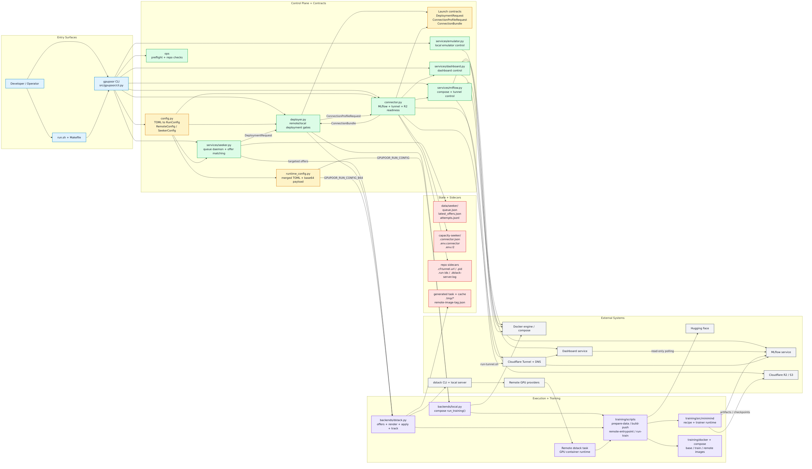
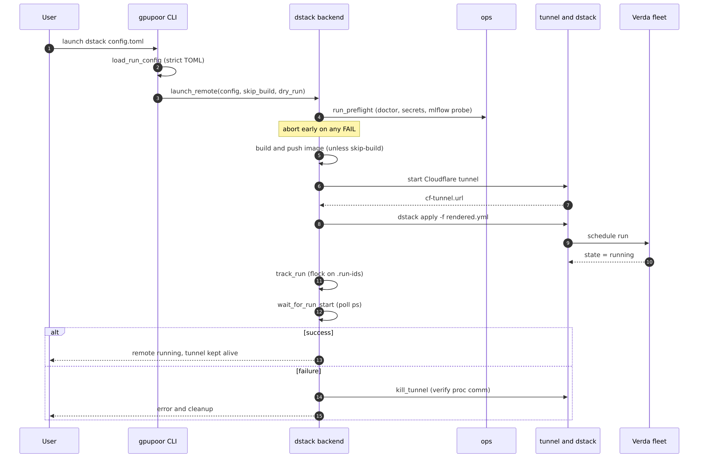
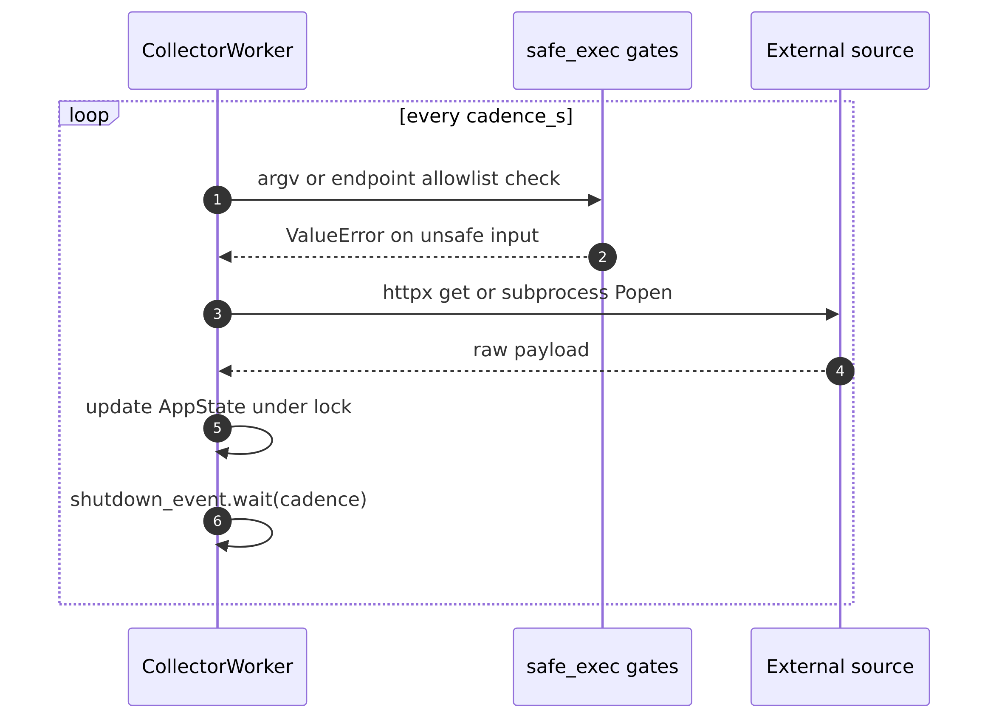
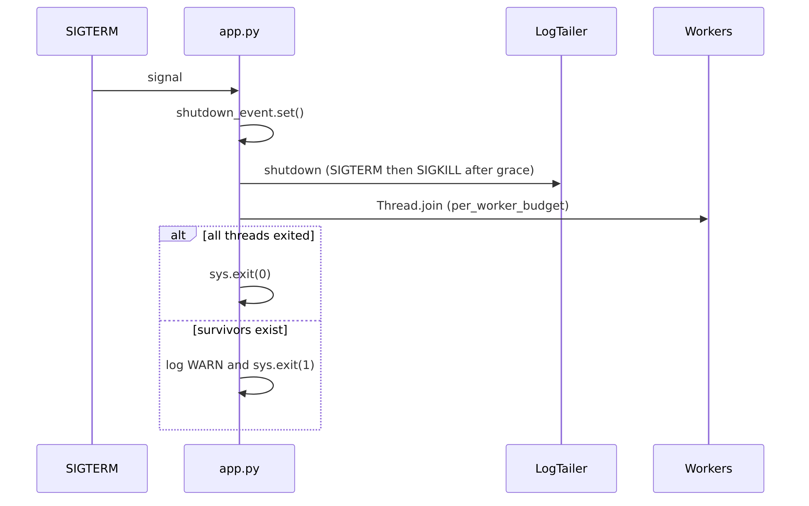

# gpupoor

> **Rent preemptible GPUs by the minute, train a reproducible MiniMind experiment, and only pay for cycles you actually burn.**

[](https://github.com/ml-maple-monk/gpu-poor-training-pipeline/actions/workflows/tests.yml)
[](https://github.com/ml-maple-monk/gpu-poor-training-pipeline/actions/workflows/quality.yml)


The **GPU-poor researcher's toolbox.** One typed TOML file drives one reproducible run of the **MiniMind** reference recipe — on your laptop CPU, a single local GPU, or an **auto-allocated preemptible GPU** on Verda/dstack. Live MLflow tracking, a hardened live dashboard, and cheap-to-fail preflights catch misconfiguration before you spend a cent.

---

## Why

Research and engineering explorations shouldn't require a lab budget. `gpupoor` targets the gap between "train in Colab" and "run on a real cluster":

- **Preemptible auto-allocation.** Declare `spot_policy = "spot"` + `max_price` + `gpu_names` in TOML. The CLI asks dstack for the cheapest **live spot offer** that matches your GPU class (A100, B300, H100 …) and schedules your run. You pay spot rate for the minutes you use — nothing else.
- **MiniMind as the first-class recipe.** A small-but-complete transformer training loop — not a toy, not a framework. Designed to actually train to completion in minutes on a rented GPU, so you can iterate on architecture/data ideas at research speed.
- **Identical local ↔ remote contract.** Same TOML, same recipe, same artifacts. Smoke on CPU first, then swap one field (`backend.kind = "dstack"`) and rent a GPU.
- **Zero runtime dependencies.** The core package adds nothing to your Python environment. Dev extras are opt-in.
- **Cheap failure first.** `gpupoor doctor` + `gpupoor smoke` verify secrets, clocks, disk, docker, and MLflow reachability before `dstack apply` is ever called. Money-spending calls are the last step, never the first.
- **Live dashboard that can't exfiltrate.** Argv allowlists, endpoint allowlists, read-only docker.sock bind, argv regex validation, SIGTERM→SIGKILL escalation on shutdown — safe to run unattended.

### Who this is for

- **Solo researchers** exploring new transformer ideas without institutional GPU access
- **Engineers** who need a small, real-stack reference for how a training pipeline *should* look
- **Students** learning LLM training without burning through a monthly credit in a single notebook session
- **Teams** that want one config format, one recipe, and one launcher across laptop, workstation, and rented GPU

---

## Install

```bash
# base (no runtime deps)
python -m pip install -e .

# dev tooling (ruff, pytest, pre-commit, mutmut)
python -m pip install -e ".[dev]"
pre-commit install

# fully-loaded dev bootstrap (installs CPU-only torch + dev extras)
make install-dev
```

Requires **Python 3.11+**. The `[dev]` extras install linter, formatter, and test runners. `make install-dev` goes further and adds CPU-only `torch` so you can run the full test lane and the local-emulator smoke test without a GPU.

---

## Quick start

### 1. Local smoke (CPU, no GPU needed)

```bash
gpupoor doctor                           # preflight: clocks, docker, secrets
gpupoor train examples/tiny_local.toml   # tiny MiniMind local run
```

This is your fast feedback loop. Iterate here until the recipe is happy, then rent a GPU.

### 2. Preemptible GPU on Verda/dstack

```bash
gpupoor infra mlflow up                              # local MLflow + Cloudflare tunnel
gpupoor launch dstack examples/verda_a100_10m.toml   # auto-allocates cheapest preemptible A100
```

What `launch dstack` actually does:

1. Loads the TOML and runs preflight locally (doctor, mlflow reachable, secrets resolved).
2. Builds and pushes your training image (skip with `--skip-build` to reuse an existing tag).
3. Opens a **Cloudflare tunnel** so the remote trainer can stream metrics to *your* local MLflow.
4. Asks dstack for the cheapest **live preemptible offer** matching `gpu_names`, `gpu_count`, and `max_price`.
5. Applies the run, tails logs, and keeps the tunnel alive until `gpupoor dstack teardown`.

The TOML in the example sets `max_price = 3.0` USD/hr and `time_cap_seconds = 600` — **bounded at $0.50 per run in the absolute worst case**, and in practice the winning spot bid is usually a small fraction of the ceiling. `time_cap_seconds` is a hard wall-clock ceiling enforced inside the trainer, so the run self-terminates before the price ever surprises you.

### 3. Dry-run the remote plan (free)

```bash
gpupoor launch dstack examples/verda_a100_10m.toml --dry-run
```

Prints the resolved `dstack apply` shape (image, env, GPU filter, time cap) without allocating anything. Use this to verify the config before burning money.

### The MiniMind recipe

[MiniMind](https://github.com/jingyaogong/minimind) is a compact, end-to-end transformer training loop — small enough to train to completion on a single preemptible GPU in minutes, complete enough to be a realistic reference for research explorations. It lives in [`training/src/minimind/`](./training/src/minimind/) and is wired into the `recipe.kind = "minimind_pretrain"` path by default. Swap datasets, change hyperparameters, or fork the recipe — the backends don't care.

---

## Architecture

<p align="center">
  
</p>

<sub><a href="./docs/diagrams/architecture.mmd">source (Mermaid)</a></sub>

**Core contract:** the CLI loads one TOML into a `RunConfig` dataclass, resolves the `backend.kind`, and hands off through the current control-plane seams: `seeker` for queued remote placement, `deployer` for launch gating, `connector` for MLflow/tunnel/R2 readiness, and then the local or dstack execution backends. Everything else — MLflow, the dashboard, emulator flows, and repo checks — stays reachable from the same CLI surface.

---

## Remote launch flow

<p align="center">
  
</p>

<sub><a href="./docs/diagrams/launch-sequence.mmd">source (Mermaid)</a></sub>

Source of truth: [`src/gpupoor/backends/dstack.py`](./src/gpupoor/backends/dstack.py) (`launch_remote`, `ensure_dstack_server`, `track_run`, `kill_tunnel`).

---

## Dashboard

The dashboard is a Gradio app that polls 7 sources on independent cadences and renders them into panels. Every external call is gated.

<p align="center">
  
</p>

<sub><a href="./docs/diagrams/dashboard-poll.mmd">source (Mermaid)</a></sub>

| Source               | Collector                                | Cadence | Gate                               |
| -------------------- | ---------------------------------------- | ------: | ---------------------------------- |
| Docker logs          | `collectors/docker_logs.py`              |      2s | argv allowlist (`logs/ps/inspect`) |
| MLflow live metrics  | `collectors/mlflow_client.py`            |      2s | endpoint allowlist                 |
| dstack REST runs     | `collectors/dstack_rest.py`              |      5s | endpoint allowlist                 |
| System (/proc, nvml) | `collectors/system.py`                   |      5s | read-only                          |
| MLflow recent runs   | `collectors/mlflow_client.py`            |     10s | endpoint allowlist                 |
| Tunnel URL           | `collectors/tunnel.py`                   |     10s | file read                          |
| Verda offers         | `collectors/verda_offers.py`             |     30s | endpoint allowlist                 |

Log tailers run alongside collectors and use the same gates; `attach` is bound to `--logs` (interactive attach is rejected before subprocess spawn).

### Shutdown (SIGTERM)

<p align="center">
  
</p>

<sub><a href="./docs/diagrams/shutdown.mmd">source (Mermaid)</a></sub>

The 35-second grace budget is split across live workers. Details: [`infrastructure/dashboard/src/app.py`](./infrastructure/dashboard/src/app.py) (`_shutdown_sequence`).

---

## CLI reference

```bash
gpupoor <command> [flags]
```

| Command                                                     | Purpose                                                             | Notable flags                                |
| ----------------------------------------------------------- | ------------------------------------------------------------------- | -------------------------------------------- |
| `gpupoor doctor [config.toml]`                              | Local preflight: clocks, disk, docker, HF token, MLflow reachability | `--skip-preflight`, `--max-clock-skew N`     |
| `gpupoor smoke [config.toml]`                               | End-to-end smoke against the local emulator                         | `--cpu`, `--prune-volumes`, `--skip-preflight` |
| `gpupoor fix-clock [config.toml]`                           | Resync WSL/container clock against host                             | —                                            |
| `gpupoor parse-secrets [secrets]`                           | Resolve `secrets` file into `.env.*` format                         | —                                            |
| `gpupoor leak-scan [image]`                                 | Scan a built docker image for secret leakage                        | `--canary` (self-test the scanner)           |
| `gpupoor check-anchors`                                     | Verify doc-anchor cross-refs between code and docs                  | —                                            |
| `gpupoor train <config.toml>`                               | Run the training recipe against the selected backend                | —                                            |
| `gpupoor launch dstack <config.toml>`                       | Launch the remote backend                                           | `--skip-build`, `--dry-run`                  |
| `gpupoor dstack <setup\|registry-login\|fleet-apply\|teardown>` | dstack lifecycle helpers                                            | `--dry-run` (`registry-login`)               |
| `gpupoor infra mlflow <up\|down\|logs\|tunnel>`             | MLflow + Cloudflare tunnel                                          | —                                            |
| `gpupoor infra dashboard <up\|down\|logs>`                  | Live dashboard service                                              | —                                            |
| `gpupoor infra emulator <up\|cpu\|nvcr\|down\|logs\|shell\|health>` | Local emulator (smoke harness)                                     | —                                            |

`doctor`, `smoke`, and `launch dstack` resolve operational defaults from the typed TOML config first; CLI flags are one-off overrides.

---

## Config reference

Every run is one TOML file. Unknown keys are rejected at load time.

| Section      | Dataclass         | Key fields                                                                                                        |
| ------------ | ----------------- | ----------------------------------------------------------------------------------------------------------------- |
| top-level    | `RunConfig.name`  | `name: str` — required; dstack runs must match `^[a-z][a-z0-9-]{1,40}$`                                           |
| `[recipe]`   | `RecipeConfig`    | `kind`, `prepare_data: bool`, `dataset_path`, `output_dir`, `time_cap_seconds`, `validation_split_ratio`, `validation_interval_steps` |
| `[backend]`  | `BackendConfig`   | `kind: "local" \| "dstack"`, `skip_build: bool`, `remote_image_tag`                                               |
| `[mlflow]`   | `MlflowConfig`    | `experiment_name`, `tracking_uri`, `artifact_upload`, `enable_system_metrics_logging`, `http_request_timeout_seconds`, `peak_tflops_per_gpu` (optional override), `time_to_target_metric`, `time_to_target_value` |
| `[doctor]`   | `DoctorConfig`    | `skip_preflight`, `max_clock_skew_seconds`                                                                        |
| `[smoke]`    | `SmokeConfig`     | `cpu`, `health_port`, `strict_port`, `degraded_port`, `sigterm_timeout_seconds`, `prune_volumes`                   |
| `[remote]`   | `RemoteConfig`    | `env_file`, `vcr_image_base`, `dstack_server_health_url`, `mlflow_health_url`, `run_start_timeout_seconds`, `gpu_names`, `gpu_count`, `spot_policy`, `max_price` |

Full schema + validators live in [`src/gpupoor/config.py`](./src/gpupoor/config.py).

### Examples

| File                                     | Backend  | Scenario                       |
| ---------------------------------------- | -------- | ------------------------------ |
| `examples/tiny_local.toml`               | `local`  | Local first run / smoke path   |
| `examples/verda_remote.toml`             | `dstack` | Default remote launch          |
| `examples/verda_a100_10m.toml`           | `dstack` | Single A100, 10-minute cap     |
| `examples/verda_a100x2_10m.toml`         | `dstack` | 2× A100, 10-minute cap         |
| `examples/verda_b300_10m.toml`           | `dstack` | Single B300, 10-minute cap     |
| `examples/verda_b300x2_10m.toml`         | `dstack` | 2× B300, 10-minute cap         |

`examples/verda_a100_10m.toml` and `examples/verda_a100x2_10m.toml` now opt into a 1% held-out validation split and 100-update validation cadence. Peak TFLOPs are auto-detected at runtime for supported Verda GPUs, while `[mlflow].peak_tflops_per_gpu` remains available as a manual override.

---

## Development

```bash
make format-check        # ruff format --check (CI required)
make lint                # ruff check (CI required)
make lint-fix            # ruff check --fix
make test-fast           # required PR test lane
make test-live           # live-dashboard / remote smoke
make ci-local            # format-check + lint + test-fast
make train-local         # launch examples/tiny_local.toml
```

**PR-required checks are `quality` and `tests`.** Live, containerized, and remote-dependent lanes stay in the non-blocking `live-checks` workflow. Promotion criteria are tracked in `.omx/plans/prd-repo-guardrails.md`.

### Regenerating the diagrams

Diagram sources live in [`docs/diagrams/`](./docs/diagrams/) as Mermaid (`.mmd`) files. Rendered PNGs are committed alongside them so the README displays on any GitHub view (Mermaid rendering can be flaky). Regenerate after an edit:

```bash
npx @mermaid-js/mermaid-cli \
  -i docs/diagrams/architecture.mmd \
  -o docs/diagrams/architecture.png \
  -s 3 -b white
```

`-s 3` renders at 3x for crisp display on retina screens.

### Environment files

Three env templates ship at the repo root:

| Template                | Purpose                                       |
| ----------------------- | --------------------------------------------- |
| `.env.example.mgmt`     | Management plane (dstack tokens, registry)    |
| `.env.example.remote`   | Remote training container (HF, MLflow, tunnel)|
| `.env.example.inference`| Inference container (HF, model paths)         |

Copy to the matching `.env.*` name, fill in secrets, and `gpupoor parse-secrets` will resolve them into a form the CLI consumes.

---

## Repo layout

```text
remote-access/
├── pyproject.toml               # package manifest + tool config
├── Makefile                     # dev + CI entry points
├── README.md                    # this file
├── design.md                    # architecture philosophy
├── TROUBLESHOOTING.md           # operator recovery playbook
├── CONTRIBUTING.md              # contributor guardrails
├── src/gpupoor/                 # package-first CLI + orchestration
│   ├── cli.py                   # argparse dispatch
│   ├── config.py                # typed TOML loader
│   ├── backends/                # local + dstack
│   ├── services/                # mlflow, dashboard, emulator
│   ├── recipes/                 # minimind reference recipe
│   ├── ops/                     # doctor, smoke, secrets, leak-scan
│   └── utils/                   # http, compose, env_files, logging
├── examples/                    # TOML run configs (6)
├── training/                    # MiniMind reference code (vendored)
├── dstack/                      # Verda/dstack runtime contract
├── infrastructure/
│   ├── mlflow/                  # MLflow container + Cloudflare tunnel
│   ├── dashboard/               # live-state Gradio UI (hardened)
│   └── local-emulator/          # CPU-only smoke harness
├── tests/                       # fast-lane regression tests
├── data/                        # datasets + caches (gitignored where large)
└── .env.example.*               # env templates
```

---

## Shell shortcuts

The `run.sh` wrapper exists so existing operator muscle memory still works. It maps named aliases onto the canonical `gpupoor` commands:

| Shortcut             | Equivalent                  |
| -------------------- | --------------------------- |
| `./run.sh local`     | `gpupoor train …`           |
| `./run.sh remote`    | `gpupoor launch dstack …`   |
| `./run.sh dashboard` | `gpupoor infra dashboard up`|

Per-component starters (`./training/start.sh`, `./dstack/start.sh`, `./infrastructure/*/start.sh`) remain for anyone driving a single service in isolation.

---

## Safety posture

- **Strict TOML** — unknown keys rejected; dstack run-names regex-gated.
- **Argv allowlists** — dashboard's dstack CLI bridge allows only `{logs, ps, attach --logs}` with per-verb flag + positional enforcement.
- **Endpoint allowlists** — dstack REST bridge allows only `{runs/get_plan, runs/list, runs/get_logs}`.
- **Container hardening** — dashboard runs `read_only: true`, `cap_drop: ALL`, `no-new-privileges`, with a **read-only** docker.sock bind.
- **No secret leakage** — rejected argv is logged as "unsafe target rejected" (the rejected value itself is never logged).
- **PID verification** — tunnel teardown verifies `/proc/<pid>/comm` matches `cloudflared` on Linux before `os.kill`.
- **Concurrent-safe state** — `.run-ids` append is protected by `fcntl.flock`; two concurrent launches cannot corrupt it.
- **Bounded shutdown** — `LogTailer` escalates SIGTERM→SIGKILL; dashboard joins workers under a 35s grace budget before exiting non-zero.

---

## Deeper docs

- [design.md](./design.md) — architectural philosophy (thin core, fat recipes, swappable backends)
- [TROUBLESHOOTING.md](./TROUBLESHOOTING.md) — operator recovery playbook
- [CONTRIBUTING.md](./CONTRIBUTING.md) — contributor guardrails
- [training/docs/README.md](./training/docs/README.md) — MiniMind recipe internals
- [dstack/docs/README.md](./dstack/docs/README.md) — Verda/dstack runtime contract
- [infrastructure/mlflow/docs/README.md](./infrastructure/mlflow/docs/README.md) — MLflow + tunnel
- [infrastructure/dashboard/docs/README.md](./infrastructure/dashboard/docs/README.md) — dashboard module reference
- [infrastructure/local-emulator/docs/README.md](./infrastructure/local-emulator/docs/README.md) — emulator smoke harness

---

## Validation contracts

- `gpupoor doctor` and `gpupoor smoke` are guarded against tracked-file mutation.
- The remote launch path prints resolved runtime values before `dstack apply`.
- Live parity surfaces are covered by tests plus non-dry-run validation.
- Every bare `except Exception` in the core package and the dashboard has been narrowed or explicitly justified.

If you're about to open a PR, run `make ci-local` first — it's the exact pair of gates CI enforces.
