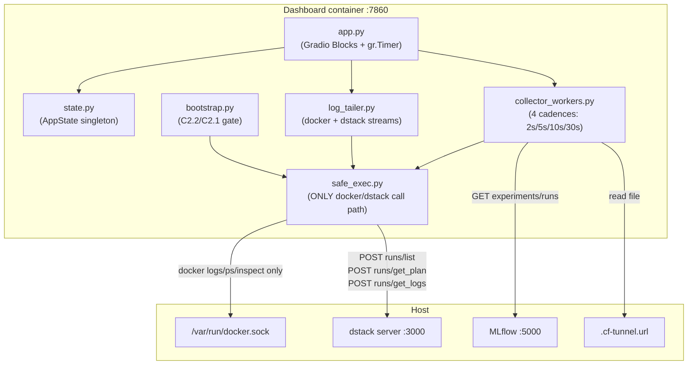
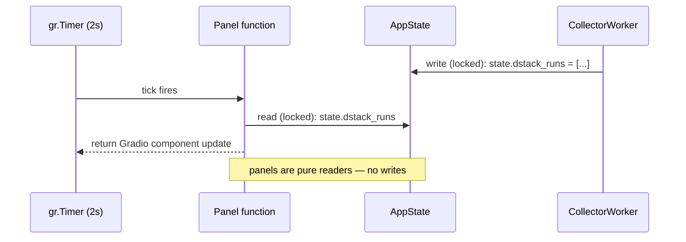

# Dashboard

Read-only Gradio control plane for the Verda remote-access host. All mutations are structurally prevented via argv whitelists and REST endpoint whitelists enforced at the code level and verified by CI grep tests.

## Architecture



## Read-only architecture — how it actually works

### What `:ro` on docker.sock does NOT do

The `:ro` flag on `/var/run/docker.sock:ro` restricts inode operations (`chmod`, `chown`, `unlink`). It does **NOT** restrict HTTP verbs over the Unix socket. Any process that can `connect()` to the socket is root-equivalent to the Docker daemon. `docker.sock:ro` is cosmetic as a security control.

### What actually enforces read-only

1. **Argv-whitelist** (`safe_exec.py`, doc-anchor: `safe-exec-allowlist`): `safe_docker(argv)` asserts `argv[0] in ALLOWED_VERBS`. Any other verb raises `ValueError` before subprocess spawn.

2. **REST-whitelist** (`safe_exec.py`, doc-anchor: `safe-exec-allowlist`): `safe_dstack_rest(endpoint)` asserts `endpoint in ALLOWED_ENDPOINTS`. Mutating endpoints are structurally unreachable.

3. **Forbidden-verb grep lint** (`tests/test_forbidden_verbs.py`): greps entire `src/` for mutating docker verbs and dstack REST paths at test time.

4. **No Docker SDK, no dstack CLI in primary path.** Only `docker` binary (logs/ps/inspect), `httpx` (dstack REST), `gradio`, `requests`.

---

## Critical code excerpts

### `safe_exec.py` — allowlists

File: `dashboard/src/safe_exec.py` — anchor `safe-exec-allowlist`

```python
# doc-anchor: safe-exec-allowlist
ALLOWED_VERBS: frozenset[str] = frozenset({"logs", "ps", "inspect"})

ALLOWED_ENDPOINTS: frozenset[str] = frozenset(
    {"runs/get_plan", "runs/list", "runs/get_logs"}
)

# endpoints that are NOT project-scoped in dstack 0.20+
_GLOBAL_ENDPOINTS: frozenset[str] = frozenset({"runs/list"})
```

`_GLOBAL_ENDPOINTS` routing: `runs/list` routes to `/api/runs/list` (no project prefix); all other allowed endpoints route to `/api/project/<project>/<endpoint>`.

### `log_tailer.py` — `_run_docker` precheck

File: `dashboard/src/log_tailer.py` — anchor `log-tailer-docker-precheck`

```python
# doc-anchor: log-tailer-docker-precheck
def _run_docker(self) -> None:
    last_missing_notice_seq = -1
    while True:
        ...
        # Precheck: is the container present at all? Avoid thrashing
        # "Error response from daemon: No such container" lines.
        inspect_rc = None
        try:
            ins = safe_docker(["inspect", target])
            _ = ins.communicate(timeout=5)
            inspect_rc = ins.returncode
        except Exception:
            inspect_rc = 1
        if inspect_rc != 0:
            # Local container absent — fall back to remote dstack CLI log stream
            remote_run = os.environ.get("REMOTE_RUN_NAME", "").strip()
            if remote_run and os.path.exists(_DSTACK_CLI):
                ...  # stream via _safe_dstack_cli(["attach", "--logs", remote_run])
```

Fallback chain:
1. `docker inspect <target>` — if container present, `docker logs -f --tail 500 <target>`
2. Container absent + `REMOTE_RUN_NAME` set + dstack CLI available → stream via `dstack attach --logs <run>`
3. Neither → log notice "container idle — training may be remote" + 30s backoff

### `collector_workers.py` — worker loop

File: `dashboard/src/collector_workers.py` — anchor `collector-worker-loop`

```python
# doc-anchor: collector-worker-loop
def _loop(self) -> None:
    while not self._shutdown.is_set():
        try:
            self._collect()
            self._tick_count += 1
        except Exception as exc:
            log.error("CollectorWorker[%s] unhandled exception: %s", self.name, exc, exc_info=True)
        self._shutdown.wait(timeout=self.cadence)
```

Isolation guarantee: exception in one worker is logged and swallowed; other workers continue unaffected. `_shutdown.wait(timeout=self.cadence)` serves as both sleep and cooperative shutdown check.

Cadences and collectors:

| Cadence | Worker name | Collector functions |
|---|---|---|
| 2s | `training-2s` | `collect_training_snapshot` |
| 2s | `live-metrics-2s` | `collect_live_metrics` |
| 5s | `dstack-5s` | `collect_dstack_runs` |
| 5s | `system-5s` | `collect_system` |
| 10s | `mlflow-10s` | `collect_mlflow_recent` |
| 10s | `tunnel-10s` | `collect_tunnel_url` |
| 30s | `offers-30s` | `collect_verda_offers` |

### `entrypoint.sh` — config generation

File: `dashboard/entrypoint.sh` — anchor `dashboard-config-gen`

```bash
# doc-anchor: dashboard-config-gen
# Materialize a ~/.dstack/config.yml the CLI can read.
if [ -n "${DSTACK_TOKEN:-}" ] && [ -n "${DSTACK_SERVER:-}" ]; then
    mkdir -p /tmp/.dstack
    cat > /tmp/.dstack/config.yml <<EOF
projects:
- default: true
  name: ${DSTACK_PROJECT:-main}
  token: ${DSTACK_TOKEN}
  url: ${DSTACK_SERVER}
EOF
    chmod 600 /tmp/.dstack/config.yml
fi
exec "$@"
```

Written to `/tmp/.dstack/config.yml` (not `~/.dstack/`) to avoid colliding with the host dstack config if the home directory is mounted. `chmod 600` prevents other container processes from reading the token.

### `dstack_rest.py` — POST runs/list

File: `dashboard/src/collectors/dstack_rest.py` — anchor `dstack-runs-list-post`

```python
# doc-anchor: dstack-runs-list-post
def collect_dstack_runs() -> tuple[list[DstackRun], SourceStatus]:
    """Fetch current dstack runs via REST (POST /api/runs/list)."""
    try:
        # dstack 0.20+ requires POST with empty filter body
        resp = safe_dstack_rest("runs/list", method="POST", json={"limit": 50})
        data = resp.json()
        runs_raw = data if isinstance(data, list) else data.get("runs", [])
        ...
```

dstack 0.18 accepted GET; 0.20+ requires POST. The `{"limit": 50}` body is required — an empty body returns 422.

### `verda_offers.py` — busybox trick

File: `dashboard/src/collectors/verda_offers.py` — anchor `verda-offers-busybox`

```python
# doc-anchor: verda-offers-busybox
def collect_verda_offers() -> tuple[list[VerdaOffer], SourceStatus]:
    """Collect GPU offers from dstack via get_plan endpoint."""
    for gpu_name in GPU_NAMES:
        resp = safe_dstack_rest(
            "runs/get_plan",
            method="POST",
            json={
                "run_spec": {
                    "configuration_path": "offers-probe",
                    "configuration": {
                        "type": "task",
                        "image": "busybox",
                        "commands": ["true"],
                        "resources": {"gpu": {"name": gpu_name, "count": 1}},
                        "spot_policy": "auto",
                    },
                    "repo_id": "offers-probe",
                    "repo_data": {"repo_type": "virtual"},
                }
            },
        )
```

**Why busybox?** `runs/get_plan` requires a valid task spec to return pricing offers. `busybox` with `commands: ["true"]` is the smallest valid task — it returns `job_plans[]` with `price` and `instance` fields without actually submitting a job. The `repo_type: virtual` avoids any git/repo requirement.

GPUs queried: `A100`, `A10`, `H100`, `RTX 4090`, `RTX 3090`, `T4`, `L4`, `V100`.

---

## Tick-to-render sequence



All writes to `AppState` happen inside `CollectorWorker` threads under `state.lock`. Panel functions read under the same lock and return Gradio component updates. No panel ever writes to state.

---

## Per-panel reference

| Panel module | Data source | Cadence | Notes |
|---|---|---|---|
| `panels/dstack_runs.py` | `state.dstack_runs` | 5s | Shows run name, status, GPU, cost/hr |
| `panels/live_metrics.py` | `state.live_metrics` | 2s | Current step, loss, LR from MLflow live endpoint |
| `panels/local_logs.py` | `LogTailer` ring buffer | 2s | `docker logs -f` or dstack attach fallback |
| `panels/mlflow_summary.py` | `state.mlflow_runs` | 10s | Recent runs table from MLflow REST |
| `panels/system_panel.py` | `state.system` | 5s | CPU, RAM, disk from psutil |
| `panels/verda_inventory.py` | `state.verda_offers` | 30s | GPU offer pricing via get_plan |
| `panels/topbar.py` | `state.tunnel_url` | 10s | CF tunnel URL badge + MLflow link |
| `panels/footer.py` | `state.collector_health` | 5s | Collector status badges |
| `panels/training.py` | `state.training` | 2s | Training snapshot (step, loss, eta) |

---

## Per-collector reference

| Collector module | Endpoint / source | Method | Notes |
|---|---|---|---|
| `collectors/dstack_rest.py` | `runs/list` | POST | dstack-runs-list-post anchor |
| `collectors/dstack_logs.py` | `runs/get_logs` | POST (stream) | Streaming httpx |
| `collectors/verda_offers.py` | `runs/get_plan` | POST | busybox probe per GPU type |
| `collectors/docker_logs.py` | `docker inspect` + `docker logs` | subprocess | Via safe_docker |
| `collectors/mlflow_client.py` | `http://mlflow:5000/api/2.0/...` | GET | requests; falls back to STALE |
| `collectors/system.py` | psutil | — | CPU, RAM, disk |
| `collectors/tunnel.py` | `.cf-tunnel.url` file | file read | Returns empty string if file absent |
| `collectors/artifacts.py` | artifact store | — | Optional; disabled by default |

---

## Security test roster (14 tests)

| Test file | Test name / description |
|---|---|
| `test_forbidden_verbs.py` | Greps `src/` for mutating docker verbs: `stop`, `kill`, `rm`, `delete`, `apply`, `run`, `up`, `down`, `push` |
| `test_forbidden_verbs.py` | Greps `src/` for mutating dstack REST paths: `/api/runs/stop`, `/api/runs/delete`, `/api/runs/apply`, `/api/users/` |
| `test_readonly.py` | `safe_docker(["stop", ...])` raises `ValueError` |
| `test_readonly.py` | `safe_docker(["rm", ...])` raises `ValueError` |
| `test_readonly.py` | `safe_docker([])` raises `ValueError` |
| `test_readonly.py` | `safe_dstack_rest("runs/stop")` raises `ValueError` |
| `test_readonly.py` | `safe_dstack_rest("runs/delete")` raises `ValueError` |
| `test_dstack_gate.py` | `runs/list` requires POST (GET returns 405 in dstack 0.20+) |
| `test_dstack_gate.py` | `runs/get_plan` body schema validated (missing repo_data → 422) |
| `test_mount_scope.py` | `docker.sock` mount is `:ro` in compose file |
| `test_mount_scope.py` | No `~/.dstack/` subtree mount in compose file |
| `test_redaction.py` | Token values redacted from log lines before ring buffer append |
| `test_ring_buffer.py` | `snapshot_since(seq)` returns only lines after seq |
| `test_threat_model.py` | No `DSTACK_SERVER_ADMIN_TOKEN` value appears in rendered config.yml content |

Run tests:
```bash
cd dashboard
pip install -r requirements.txt pytest
pytest tests/ -v
```

---

## Run locally

```bash
# Via run.sh (recommended)
export DSTACK_SERVER_ADMIN_TOKEN="your-token"
./run.sh dashboard up
# http://localhost:7860

./run.sh dashboard logs
./run.sh dashboard down

# Manually
cd dashboard
docker compose -f docker-compose.dashboard.yml up -d
```

---

## Environment variables

| Variable | Default | Description |
|---|---|---|
| `DSTACK_SERVER_ADMIN_TOKEN` | required | dstack admin token; injected from host env |
| `DSTACK_SERVER_URL` | `http://host.docker.internal:3000` | dstack server URL |
| `DSTACK_PROJECT` | `main` | dstack project name |
| `DSTACK_TOKEN` | — | Token written to `/tmp/.dstack/config.yml` by entrypoint |
| `DSTACK_SERVER` | `http://host.docker.internal:3000` | Server URL for CLI config |
| `TRAINER_CONTAINER` | `minimind-trainer` | Docker container name to tail |
| `MLFLOW_URL` | `http://mlflow:5000` | MLflow inside compose network |
| `REMOTE_RUN_NAME` | — | dstack run name for remote log fallback |

---

## Documented follow-ups (out of scope)

- **F1:** `tecnativa/docker-socket-proxy` in front of `/var/run/docker.sock` for daemon-level read-only enforcement
- **F2:** Artifacts browser panel
- **F3:** Per-viewer log target selection
- **F5:** Migrate from admin token to dstack scoped API key when available

---

## See also

- [README.md](../README.md#security-posture) — Security Posture table (exposure 3: docker.sock)
- [TROUBLESHOOTING.md](../TROUBLESHOOTING.md) — tmpfs shadow, runs/list POST-only, get_plan body schema, tmpfs 0700
- [dstack/README.md](../dstack/README.md) — dstack server config, REST endpoint context
