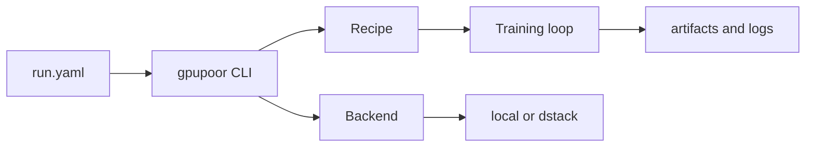

Your repo already has the right bones: a clear three-part mental model (`training/`, `dstack/`, `infrastructure/`), repo-owned training code, and useful operator entrypoints. The gap is that it is still system-repo-first and shell-first, not yet framework-first and package-first. The repo notes already point in the right direction: move the reusable contract into a real Python package under `src/`, make one CLI the public surface, keep MiniMind as a reference recipe, and treat dstack as a backend/provider rather than the center of the architecture.  

The strongest backbone is already in your design draft: one declarative config, a thin orchestrator with fat recipes, swappable backends, opt-in plugins, and parity before replacing old shell flows. I would keep those, but rewrite them in beginner language and use them as the “house rules” for every PR. 

## The philosophy I would use

Build for the person who wants:

* a first successful run in 5 minutes
* a first meaningful edit in 15 minutes
* a first custom experiment in 60 minutes

That leads to an ADHD-friendly philosophy like this:

1. **First success before first theory.**
   The very first thing in the repo should be a tiny run that works on CPU or a weak GPU. A beginner should get a green result before reading architecture docs.

2. **One concept, one name, one place.**
   Pick a tiny vocabulary and never drift. For example: `recipe`, `backend`, `run config`, `artifacts`. Do not also say `job`, `task`, `launcher`, `experiment spec`, `provider config` unless they are truly different things.

3. **Examples before abstractions.**
   Show one concrete recipe class and one concrete backend first. Only add generic interfaces after you have at least two real cases.

4. **Visible state beats hidden magic.**
   The user should always know what config was loaded, what backend is active, where artifacts are being written, and what to run next.

5. **Low-choice top layer, rich lower layers.**
   The README and first CLI path should be narrow and obvious. Advanced tuning, plugins, SDKs, and power-user overrides should exist, but they should live one layer deeper.

6. **Every error message should teach.**
   Not just “failed,” but “what failed / why / exact fix.”

7. **Fancy should reduce thinking, not add decoration.**
   A calm diagram, a quickstart block, a core-components table, and a docs map are “fancy.” Huge badge walls, giant feature matrices, and long prose intros are not.

## Detailed, actionable design criteria

I would use these as actual design criteria for the framework.

### 1. One run = one config file

A run should be representable by one typed config file, not by a shell script plus hidden environment assumptions.

Done when:

* `gpupoor train examples/tiny_cpu.yaml` works
* `gpupoor launch dstack examples/tiny_cpu.yaml` uses the same recipe config
* the framework can print the fully resolved config before execution
* public config is typed, documented, and stable

This matches the existing recommendation to move away from shell-owned config toward a typed contract usable from YAML, Python, and CLI.  

### 2. Keep the current mental model, but move the contract into `src/`

Do not throw away the clear repo story you already have. Preserve the visible split, but make the reusable code live in a package.

Done when:

* the repo still makes sense as `training`, `dstack`, `infrastructure`
* reusable framework code lives under `src/<package>/`
* shell scripts become wrappers, not the real API

That keeps the repo understandable while turning it into something installable and teachable.  

### 3. Thin core, fat recipes

The framework core should coordinate runs, not contain training logic.

Done when:

* `core/` does not import `torch`, `transformers`, `datasets`, or training-loop code
* training loops, optimizer logic, checkpoint policy, and model-specific behavior live in `recipes/`
* reviewers can reject PRs that put model/training logic into orchestration code

This is one of the best teaching lessons in the design doc because it forces a clean boundary between framework and experiment code. 

### 4. Concrete first, abstract later

Do not invent a grand plugin or recipe hierarchy on day one.

Done when:

* you ship one concrete recipe first
* you only extract a generic `Recipe` interface after a second real recipe needs it
* every abstraction can point to at least two working implementations

This is beginner-friendly because it teaches “abstraction follows evidence,” which is a core framework habit. 

### 5. MiniMind should be a built-in example, not the framework identity

MiniMind is valuable, but it should teach the framework rather than define it.

Done when:

* docs say “MiniMind is a reference recipe”
* adding a second model does not require changing the framework’s main concepts
* package names and docs are model-agnostic

That change matters because your current notes already flag that the repo still feels too centered on `minimind`. 

### 6. One public CLI should be the main interface

Your current shell UX is useful. Keep the shape, but move the real behavior behind Python.

Done when:

* the public interface is something like `gpupoor doctor`, `gpupoor smoke`, `gpupoor train`, `gpupoor launch dstack`
* `run.sh`, `training/start.sh`, and `dstack/start.sh` delegate to that CLI
* a user can ignore the shell layer entirely

This matches both the repo review and the public framework recommendations.  

### 7. Backends must be swappable

The recipe should not care whether it runs locally or via dstack.

Done when:

* `LocalBackend` and `DstackBackend` satisfy the same interface
* recipes never check `if backend == "dstack"`
* switching backend is a config change, not a recipe rewrite

This is one of the most important framework lessons because it prevents infra from contaminating experiment code. 

### 8. GPU-poor should be a first-class design constraint

Do not treat low-resource training as an edge case. Make it the default teaching path.

Done when the repo ships these presets:

* `examples/tiny_cpu.yaml`
* `examples/lora_single_gpu.yaml`
* `examples/qlora_cheap_gpu.yaml`
* `examples/full_ft_large_gpu.yaml`

And each example clearly states:

* expected VRAM
* expected runtime class
* dataset size class
* intended learning goal

This is where your framework can become genuinely distinctive.

### 9. Cheap failure should be a feature

A GPU-poor framework should fail early and cheaply.

Done when you have:

* `gpupoor doctor` for environment checks
* `gpupoor smoke` for tiny end-to-end validation
* `gpupoor estimate` for rough VRAM/time class
* `gpupoor explain-config` for debugging config resolution

A beginner should be able to answer “will this probably fit?” before paying for a remote run.

### 10. Experiments must be traceable by default

A good experiment framework teaches reproducibility, not just launchability.

Done when every run folder contains:

* original config
* resolved config
* git SHA
* package versions
* seed
* backend used
* dataset id/path
* hardware summary
* artifact/output path

This turns experiments into something you can compare, resume, and explain.

### 11. Base install must stay small

The easiest install should not pull in Docker, dstack, MLflow, dashboard code, and every training dependency.

Done when:

* `pip install gpupoor` gives the small local/base path
* `pip install "gpupoor[dstack]"` adds remote launch
* `pip install "gpupoor[mlflow]"` adds observability
* `pip install "gpupoor[docker]"` adds image-building helpers

That keeps the beginner path clean and matches your repo’s own recommendation to separate optional tools from the base contract.  

### 12. Nothing should auto-magically change behavior

Hidden plugin loading is bad for focus and bad for reproducibility.

Done when:

* plugins only load if declared in config
* the framework can print which plugins were loaded
* installing a package never silently changes behavior

That is both ADHD-friendly and good framework engineering. 

### 13. Secrets and provider config should be explicit

Do not make infra configuration mysterious.

Done when:

* secret precedence is documented
* provider config can be inspected
* the user can run a debug command to see where values came from
* backend-specific config does not leak everywhere else

This prevents the “I have no idea why this run worked yesterday” feeling.

### 14. Docs should follow the user’s learning order

The public recommendations are right here: keep the root README short, and move deeper learning into `tutorials/`, `how-to/`, `concepts/`, and `reference/`. 

Done when:

* README only answers what it is, who it is for, install, first local run, first remote run, and where to go next
* `tutorials/` teaches first runs
* `how-to/` teaches extension work
* `concepts/` teaches architecture
* `reference/` lists CLI/config/API

### 15. Turn your design criteria into review rules

This is how you keep the framework clean after the first draft.

Reject PRs that:

* add new config surfaces outside the typed run config
* import training libraries into core orchestration code
* hardcode dstack logic inside recipes
* auto-load plugins without declaration
* remove old shell behavior before parity is proven

Your design doc already points toward exactly this style of mechanical review. 

## The GPU-poor rules I would hard-code

These are worth making non-negotiable:

* Every feature must have a tiny example.
* Every recipe must declare a “budget class” such as CPU, 8GB GPU, 24GB GPU, 80GB GPU.
* Resume-from-checkpoint must work before multi-node polish.
* Dataset preprocessing should be cacheable and reusable.
* Logs should always show batch size, grad accumulation, effective batch size, sequence length, and estimated memory pressure.
* The framework should prefer LoRA/QLoRA teaching examples before full fine-tuning.
* CPU smoke should not require Docker.

That last point is especially good because it keeps CI, docs, and new-user onboarding cheap.

## A README that is fancy but calm

The current repo README already does one thing well: it names the core subsystems and shows the main entry surfaces. Keep that clarity, but tighten the root README into a landing page instead of a full operator manual.  

I would structure it like this:

````md
# gpupoor

Train readable, reproducible LLM experiments on limited GPUs without drowning in bash.

> Best for solo researchers, students, and engineers using CPU, one local GPU, or cheap remote GPUs.
> Same config for local and remote. Tiny examples first. Heavy features optional.

## Quickstart

```bash
pip install gpupoor
gpupoor doctor
gpupoor smoke examples/tiny_cpu.yaml
gpupoor train examples/lora_single_gpu.yaml
````

## Remote quickstart

```bash
pip install "gpupoor[dstack]"
gpupoor doctor
gpupoor launch dstack examples/qlora_cheap_gpu.yaml
```

## Mental model

* `recipe` = training logic
* `backend` = where it runs
* `run config` = one typed file describing one run
* `artifacts` = checkpoints, logs, metrics, exports

## Architecture



## Core components

* `src/gpupoor/core/` — config, orchestration, plugin loading
* `src/gpupoor/recipes/` — training recipes
* `src/gpupoor/backends/` — local and remote backends
* `src/gpupoor/observability/` — optional logging and tracking
* `examples/` — runnable configs and extension examples

## Choose your path

* First local run
* First cheap remote run
* Add a new recipe
* Add a new backend

## Docs

* tutorials/
* how-to/
* concepts/
* reference/

## Status

* Stable: local runs, tiny examples, core config
* Beta: dstack backend
* Experimental: plugins, dashboards, advanced providers

```

The trick is that this README looks polished, but every section lowers cognitive load.

## What to copy from LLaMA-Factory, PyTorch, and Hugging Face

Copy the pattern, not the size.

LLaMA-Factory is worth copying for its single CLI plus example-YAML workflow. Its examples README centers usage around commands like `llamafactory-cli train ...yaml` and shows many concrete example paths across pretraining, SFT, DPO, preprocessing, export, chat, webchat, and API flows. That is great for ADHD learners because it makes “copy this file, run this command” the default path. :contentReference[oaicite:20]{index=20}

PyTorch is worth copying for its teaching shape. Its tutorials explicitly frame learning as a complete ML workflow, and the tutorials index separates “Learn the Basics” from bite-size “Recipes.” That is exactly how your docs should feel: basics for first understanding, recipes for practical snippets, reference for details. :contentReference[oaicite:21]{index=21}

Transformers is worth copying for beginner ergonomics. Its installation docs include a quick smoke test right after install, and its `pipeline()` abstraction gives a simple entry point that hides a lot of complexity. Hugging Face also layers learning beyond the API itself through a course that moves from concepts to model use to fine-tuning. :contentReference[oaicite:22]{index=22}

The part **not** to copy from any of them is sheer breadth too early. Your own public-framework notes are right: start with one package, one CLI, one reference recipe, one provider boundary, then grow only when the second real use case appears. :contentReference[oaicite:23]{index=23}

The best first milestone is very small: `pyproject.toml`, `src/gpupoor/`, one typed `RunConfig`, one `gpupoor doctor`, one `gpupoor train`, one `tiny_cpu.yaml`, and a root README built exactly around that path.
::contentReference[oaicite:24]{index=24}
```
