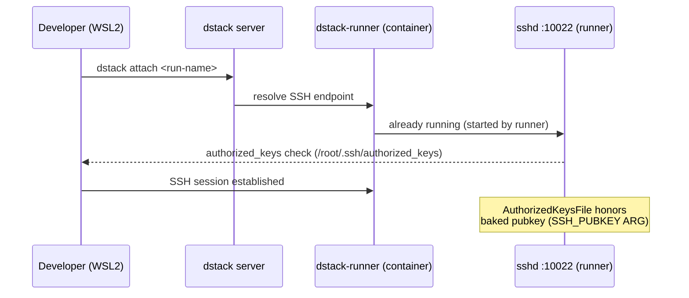

# dstack Integration

Reference for dstack installation, fleet configuration, pretrain task YAML, SSH access, and registry auth.

## Install via uv (isolated venv — required)

dstack 0.18–0.20 pins pydantic v1. Installing into a system Python with pydantic v2 causes `ValidationError` on startup. Use an isolated venv:

```bash
# Install uv if not present
curl -LsSf https://astral.sh/uv/install.sh | sh

# Create dedicated venv at a non-/tmp path
uv venv ~/.dstack-cli-venv --python 3.11

# Install dstack with verda extras
uv pip install --python ~/.dstack-cli-venv/bin/python 'dstack[verda]'

# Make available on PATH
echo 'export PATH="$HOME/.dstack-cli-venv/bin:$PATH"' >> ~/.bashrc
source ~/.bashrc

# Verify
dstack --version
```

**Why not `/tmp`?** `/tmp` is often a `tmpfs` mount cleared on reboot. The venv would disappear after WSL2 restart. Use `~/.dstack-cli-venv` or another persistent path.

**Version pinning:** Pin to a specific release to avoid breaking changes between dstack versions:
```bash
uv pip install --python ~/.dstack-cli-venv/bin/python 'dstack[verda]==0.20.*'
```

---

## `dstack/setup-config.sh`

Writes `~/.dstack/server/config.yml` with Verda backend credentials. Reads from `./secrets`.

```bash
bash dstack/setup-config.sh
```

Idempotent — safe to run multiple times. Parses both `ClientID` and `CliendID` (Verda UI typo). Output file is mode 600.

Generated config structure:
```yaml
projects:
  - name: main
    backends:
      - type: verda
        creds:
          type: api_key
          client_id: <parsed-from-secrets>
          client_secret: <parsed-from-secrets>
```

---

## `/tmp/.dstack/config.yml` — dashboard CLI config

The dashboard `entrypoint.sh` (doc-anchor: `dashboard-config-gen`) generates a separate CLI config inside the container at `/tmp/.dstack/config.yml`:

```bash
mkdir -p /tmp/.dstack
cat > /tmp/.dstack/config.yml <<EOF
projects:
- default: true
  name: ${DSTACK_PROJECT:-main}
  token: ${DSTACK_TOKEN}
  url: ${DSTACK_SERVER}
EOF
chmod 600 /tmp/.dstack/config.yml
```

This is distinct from `~/.dstack/server/config.yml` on the host. The container uses token-based auth (`DSTACK_TOKEN`) against the already-running dstack server.

---

## `verda-container-registry-login.sh`

Performs `docker login` against the Verda Container Registry (`vccr.io`). Contains the literal login command with the project-scoped credential.

```bash
bash verda-container-registry-login.sh
```

**Registry auth gotcha — `+` character:** The VCR credential username contains `+` (e.g. `vcr-<uuid>+credential-1`). When this is interpolated into dstack YAML via `${{ env.VCR_USERNAME }}`, the `+` is passed verbatim. However, some URL parsers interpret `+` as a space in query strings. Always pass credentials via environment variables, never via URL-embedded auth strings.

Verify the rendered YAML is correct:
```bash
cat dstack/.pretrain.rendered.yml | grep -A2 registry_auth
```

---

## Annotated `pretrain.dstack.yml`

File: `dstack/pretrain.dstack.yml` — anchor `dstack-task-yaml`

```yaml
# doc-anchor: dstack-task-yaml
type: task
name: verda-minimind-pretrain

# Verda Container Registry — colocated with Verda compute for fast pulls
image: vccr.io/<verda-project-uuid>/verda-minimind:${{ env.IMAGE_SHA }}
registry_auth:
  username: ${{ env.VCR_USERNAME }}
  password: ${{ env.VCR_PASSWORD }}

env:
  - HF_TOKEN                             # required — dataset download
  - MLFLOW_TRACKING_URI                  # required — CF tunnel URL
  - MLFLOW_EXPERIMENT_NAME=minimind-pretrain-remote
  - MLFLOW_ARTIFACT_UPLOAD=0
  - VERDA_PROFILE=remote
  - DSTACK_RUN_NAME=verda-minimind-pretrain
  - OUT_DIR=/workspace/out
  - HF_DATASET_REPO=jingyaogong/minimind_dataset
  - HF_DATASET_FILENAME=pretrain_t2t_mini.jsonl

commands:
  - bash /opt/minimind/training/remote-entrypoint.sh

resources:
  gpu:
    name: [H100, H200, A100]   # dstack picks by price within max_price
    count: 1

spot_policy: spot
max_price: 1.5         # USD/hr — H200 spot ~$1.19; A100 80 ~$0.45; H100 spot ~$0.80
max_duration: 10m      # safety cap for demo runs
idle_duration: 0s      # terminate instance immediately when task exits

retry:
  on_events:
    - no-capacity
    - interruption
  duration: 30m
```

Key fields:
- `idle_duration: 0s` — instance released the moment `remote-entrypoint.sh` exits. Without this, the default is `nil` (indefinite), causing orphan billing.
- `max_duration: 10m` — hard cap for demo runs. Extend for production (e.g. `6h`).
- `retry.on_events` — retries only on infrastructure events (no-capacity, interruption), NOT on training errors (non-zero exit).
- No `files:` stanza — the image is the source of truth; dataset downloaded at runtime.

**Alternative registry (GHCR, commented out in file):**
```yaml
# image: ghcr.io/${{ env.GH_USER }}/verda-minimind:${{ env.IMAGE_SHA }}
# registry_auth:
#   username: ${{ env.GH_USER }}
#   password: ${{ env.GH_TOKEN }}
```

---

## Annotated `fleet.dstack.yml`

File: `dstack/fleet.dstack.yml` — anchor `dstack-fleet-yaml`

```yaml
# doc-anchor: dstack-fleet-yaml
type: fleet
name: verda-spot
nodes:
  min: 0
  max: 2
resources:
  gpu:
    vendor: nvidia
    name: [H100, H200, A100]
    count: 1
backends: [verda]
spot_policy: spot
max_price: 1.5
# Auto-terminate instances after 5 min of idle — prevents orphan billing.
# dstack default when omitted is INDEFINITE (nil), not 5m.
idle_duration: 5m
```

Key fields:
- `min: 0` — no instances when idle (no standing cost)
- `max: 2` — allows two concurrent spot jobs
- `idle_duration: 5m` — **critical**: prevents orphan billing after task exit. The dstack default when this field is omitted is `nil` (indefinite). See [TROUBLESHOOTING.md](../TROUBLESHOOTING.md) row 6.

Apply fleet:
```bash
dstack apply -f dstack/fleet.dstack.yml -y
```

Check fleet status:
```bash
dstack fleet list
```

---

## SSH sequence diagram



SSH access does NOT require port 22 forwarding. dstack-runner manages the SSH tunnel. The baked pubkey from `Dockerfile.remote`'s `SSH_PUBKEY` ARG is recognized by dstack-runner's sshd at `/dstack/ssh/conf/authorized_keys .ssh/authorized_keys`.

Direct SSH after `dstack attach`:
```bash
ssh -i ~/.ssh/id_ed25519 -o IdentitiesOnly=yes verda-minimind-pretrain
```

---

## Cost controls

| Control | Location | Value | Effect |
|---|---|---|---|
| `max_price` | `pretrain.dstack.yml` | `1.5` USD/hr | dstack rejects instances above this price |
| `max_duration` | `pretrain.dstack.yml` | `10m` | Hard cap; task killed at timeout |
| `idle_duration` (task) | `pretrain.dstack.yml` | `0s` | Instance released immediately on task exit |
| `idle_duration` (fleet) | `fleet.dstack.yml` | `5m` | Instance released 5min after last task |
| `spot_policy` | both files | `spot` | Spot pricing only; no on-demand fallback |
| `nodes.min` | `fleet.dstack.yml` | `0` | Zero standing fleet cost |

---

## See also

- [training/README.md](../training/README.md) — `build-and-push.sh`, image tags, `remote-entrypoint.sh`
- [TROUBLESHOOTING.md](../TROUBLESHOOTING.md) — pydantic conflict, fleet idle_duration, registry auth `+` char, ports:2222:22, runs/list POST-only
