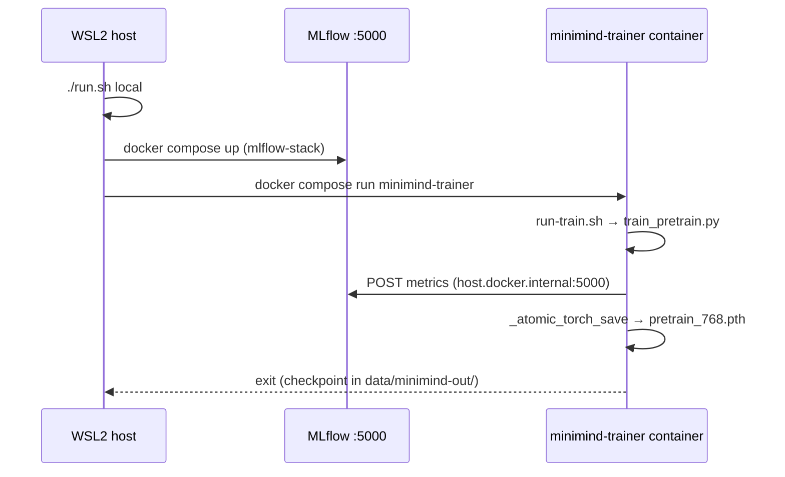
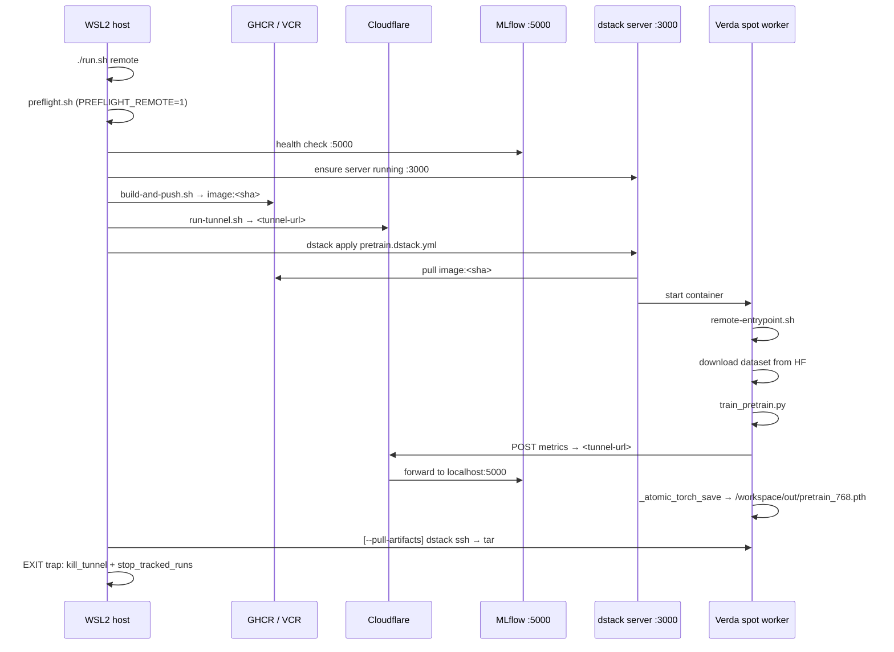

# Training Pipeline

End-to-end reference for building, pushing, and running the minimind pretraining pipeline, both locally (docker-compose) and remotely (Verda spot GPU via dstack).

## Overview

Two execution paths share the same minimind source and checkpoint format:

| Path | Trigger | Compute | Dataset source | Metrics |
|---|---|---|---|---|
| **Local** | `./run.sh local` | WSL2 host GPU | `minimind/dataset/pretrain_t2t_mini.jsonl` (bind-mount) | MLflow via `http://host.docker.internal:5000` |
| **Remote** | `./run.sh remote` | Verda H100/A100 spot | HF download at container start | MLflow via CF tunnel URL |

Both paths produce `pretrain_768.pth` checkpoints and log identical metrics to MLflow.

---

## Local training sequence



---

## Remote training sequence



---

## File-by-file reference

### `training/remote-entrypoint.sh`

Runs inside the Verda container. Responsibilities: print diagnostic banner, download dataset if missing, validate size, exec `train_pretrain.py`.

File: `training/remote-entrypoint.sh` — anchor `remote-entrypoint-train-exec`

```bash
# doc-anchor: remote-entrypoint-train-exec
echo "[remote-entrypoint] Starting train_pretrain.py ..."
cd /opt/minimind/trainer

exec python train_pretrain.py \
    --epochs 1 \
    --batch_size 16 \
    --accumulation_steps 8 \
    --num_workers 4 \
    --hidden_size 768 \
    --num_hidden_layers 8 \
    --max_seq_len 340 \
    --dtype bfloat16 \
    --log_interval 10 \
    --save_interval 100 \
    --use_compile 0 \
    --data_path "$DATASET_FILE" \
    --save_dir "$OUT_DIR"
```

Key behaviors:
- `DATA_DIR=/workspace/data`, `OUT_DIR=${OUT_DIR:-/workspace/out}` — both created by `mkdir -p`
- Dataset validated: must be ≥ 500 MB (`DATASET_MIN_BYTES=524288000`); corrupted/truncated file is deleted and run exits 1
- `exec` replaces the shell process — SIGTERM from dstack propagates directly to `train_pretrain.py`
- SSH note baked in: dstack-runner's sshd on `:10022` already honors `/root/.ssh/authorized_keys`

---

### `training/Dockerfile.remote`

Remote training image. Base: `pytorch/pytorch:2.4.1-cuda12.4-cudnn9-runtime` (~5 GB runtime, no DEVEL headers).

File: `training/Dockerfile.remote` — anchor `remote-dockerfile-ssh-bake`

```dockerfile
# doc-anchor: remote-dockerfile-ssh-bake
# Inject operator's SSH pubkey at build time (ARG) — empty value disables sshd.
ARG SSH_PUBKEY=""
RUN if [ -n "$SSH_PUBKEY" ]; then \
        echo "$SSH_PUBKEY" > /root/.ssh/authorized_keys && \
        chmod 600 /root/.ssh/authorized_keys; \
    fi
EXPOSE 22
```

Build steps in order:
1. System packages: `git curl coreutils rsync openssh-server`
2. `SSH_PUBKEY` ARG baked into `/root/.ssh/authorized_keys` (empty = no SSH access)
3. `requirements.train.txt` pip install
4. `minimind/` source baked at `/opt/minimind/`
5. `training/patches/` baked at `/opt/patches/`
6. `remote-entrypoint.sh` baked and made executable
7. `git apply /opt/patches/minimind-atomic-save.patch` applied at build time
8. `/workspace/data /workspace/out /workspace/hf_cache` created

**Security note:** `SSH_PUBKEY` lives in an image layer. This layer is safe only while the registry is private. See [Security Posture](../README.md#security-posture) row 4.

---

### `training/patches/minimind-atomic-save.patch`

File: `training/patches/minimind-atomic-save.patch` — anchor `atomic-save-sigterm`

Patches `minimind/trainer/train_pretrain.py` to add:

1. **`_atomic_torch_save(obj, path)`** — saves to `path + ".tmp"` then `os.replace(tmp, path)`. Prevents a half-written checkpoint if the process is killed mid-save.

2. **SIGTERM handler** (`_sigterm_handler`) — state machine:

```
SIGTERM received
  │
  ├─ set _stop_flag = True
  ├─ wait up to 30s for _save_thread (if active)
  ├─ glob + delete any residual *.tmp files in save_dir
  ├─ _mlflow_finish(status="KILLED")
  └─ sys.exit(143)
```

3. **`signal.signal(signal.SIGTERM, _sigterm_handler)`** — registered in `__main__` before training loop.

The patch replaces the single `torch.save(...)` call with `_atomic_torch_save(...)`.

Test coverage: `training/tests/test_sigterm.py` validates normal exit, SIGTERM mid-run, no `.tmp` residue, and MLflow status `KILLED`.

---

### `training/mlflow-stack/patches/_mlflow_helper.py`

MLflow integration module. Zero-behavior when `MLFLOW_TRACKING_URI` is unset or server unreachable.

File: `training/mlflow-stack/patches/_mlflow_helper.py` — anchor `mlflow-helper-start`

```python
# doc-anchor: mlflow-helper-start
def start(args, model_config, script_name="train_pretrain"):
    global _active, _start_time
    uri = os.environ.get("MLFLOW_TRACKING_URI", "").strip()
    if not uri:
        print("[mlflow] MLFLOW_TRACKING_URI not set — skipping integration", flush=True)
        return
    ...
    exp_name = os.environ.get("MLFLOW_EXPERIMENT_NAME", "minimind-pretrain")
    mlflow.set_experiment(exp_name)
    run_name = (
        f"{script_name}-h{args.hidden_size}-L{args.num_hidden_layers}"
        f"-bs{args.batch_size}-lr{args.learning_rate}"
    )
    ...
    tags = {
        "script": script_name,
        "model_family": "minimind",
        "verda.profile": os.environ.get("VERDA_PROFILE", ""),
        "verda.emulation": os.environ.get("VERDA_EMULATION", "true"),
    }
    mlflow.start_run(run_name=run_name, log_system_metrics=log_sys, tags=tags)
```

Experiment naming:
- Local training overlay: `MLFLOW_EXPERIMENT_NAME=minimind-pretrain`
- Remote (`pretrain.dstack.yml`): `MLFLOW_EXPERIMENT_NAME=minimind-pretrain-remote`

The `@_safe` decorator wraps every logging call — any exception is printed and swallowed; training never fails due to a logging issue.

---

### `training/build-and-push.sh`

Builds `Dockerfile.remote` and pushes to GHCR. Tags: `ghcr.io/<GH_USER>/verda-minimind:<git-short-SHA>` and `:latest`.

File: `training/build-and-push.sh` — anchor `image-render-template`

```bash
# doc-anchor: image-render-template
SHA=$(git -C "$REPO_ROOT" rev-parse --short HEAD 2>/dev/null || echo "local")
IMAGE_BASE="ghcr.io/${GH_USER}/verda-minimind"
IMAGE_SHA="${IMAGE_BASE}:${SHA}"
IMAGE_LATEST="${IMAGE_BASE}:latest"
```

After push, sets GHCR package visibility to public via GitHub API PATCH (idempotent). Returns HTTP 200/204 on success, 404 if package not yet propagated (first push only).

GH_USER resolution order:
1. `./gh_user` file (explicit override)
2. `.omc/state/gh_user.cache` (cached from preflight)
3. GitHub API `GET /user` with `gh_token`

---

### `training/run-train.sh`

Local training wrapper. Runs inside the container via `docker compose run`. Sets `TIME_CAP_SECONDS` (default 600s) and uses `timeout --signal=SIGTERM` so the atomic-save + SIGTERM handler is exercised. Exit code 124 (timeout) is treated as success for the 10-min simulation.

---

### `training/setup-minimind.sh`

Clones minimind (`git clone --depth 1`) if not present and downloads `pretrain_t2t_mini.jsonl` (~1.2 GB) from HF. Validates size ≥ 500 MB before exit. Idempotent — skips download if already present.

---

### `training/lib/jq-fallback.sh`

Sourced by `run.sh`. Provides portable JSON parsing: uses `jq` if available, falls back to `python3 -c "import json,sys; ..."`. No external dependency required.

---

## Dataset cache layout

```
/workspace/              (remote container)
├── data/
│   └── pretrain_t2t_mini.jsonl   (1.2 GB, downloaded by remote-entrypoint.sh)
├── out/
│   └── pretrain_768.pth          (checkpoint, written by train_pretrain.py)
└── hf_cache/                     (HF_HOME — model weights cache)

minimind/dataset/                  (local bind-mount path)
└── pretrain_t2t_mini.jsonl        (1.2 GB, downloaded by setup-minimind.sh)

data/minimind-out/                 (local output, bind-mount to /data/minimind-out)
└── pretrain_768.pth
```

---

## test_sigterm.py reference

`training/tests/test_sigterm.py` — 5 test cases using a `trainer_stub` (no GPU, no real dataset, no real MLflow):

| Test | What it checks |
|---|---|
| `test_checkpoint_loadable_after_normal_run` | Normal exit: `pretrain_768.pth` loadable by `torch.load` |
| `test_no_tmp_residue_after_normal_run` | Normal exit: no `*.tmp` files remain |
| `test_sigterm_checkpoint_loadable` | SIGTERM mid-run: checkpoint still loadable; exit code 143 |
| `test_sigterm_no_tmp_residue` | SIGTERM mid-run: no `*.tmp` residue |
| `test_sigterm_mlflow_status_killed` | SIGTERM mid-run: MLflow status file written as `KILLED` |

Run:
```bash
cd training
pip install torch pytest
pytest tests/test_sigterm.py -v
```

---

## SIGTERM state machine (summary)

```
train_pretrain.py running
        │
        │  SIGTERM (from dstack on preemption / max_duration / idle_duration: 0s)
        ▼
_sigterm_handler()
        ├── _stop_flag = True
        ├── join _save_thread (up to 30s)
        ├── glob *.tmp in save_dir → os.remove each
        ├── _mlflow_finish(status="KILLED")
        └── sys.exit(143)
                │
                ▼
        Container exits cleanly
        dstack marks run as "terminated"
        idle_duration: 0s → instance released immediately
```

---

## Environment variables (training-specific)

| Variable | Default | Used by | Notes |
|---|---|---|---|
| `HF_TOKEN` | required | `remote-entrypoint.sh` | Dataset download from HF |
| `MLFLOW_TRACKING_URI` | — | `_mlflow_helper.py` | CF tunnel URL injected by `run.sh` |
| `MLFLOW_EXPERIMENT_NAME` | `minimind-pretrain-remote` | `_mlflow_helper.py` | Set to `minimind-pretrain` for local runs |
| `MLFLOW_ARTIFACT_UPLOAD` | `0` | `remote-entrypoint.sh` banner | `1` = upload checkpoints via MLflow |
| `VERDA_PROFILE` | `remote` | `_mlflow_helper.py` tags | `local` for docker-compose runs |
| `OUT_DIR` | `/workspace/out` | `remote-entrypoint.sh` | Checkpoint directory |
| `HF_DATASET_REPO` | `jingyaogong/minimind_dataset` | `remote-entrypoint.sh` | HF repo ID |
| `HF_DATASET_FILENAME` | `pretrain_t2t_mini.jsonl` | `remote-entrypoint.sh` | File within repo |
| `TIME_CAP_SECONDS` | `600` | `run-train.sh` | Local training time cap |
| `DSTACK_RUN_NAME` | `verda-minimind-pretrain` | `_mlflow_helper.py` tags | Injected by dstack |

---

## See also

- [training/mlflow-stack/README.md](./mlflow-stack/README.md) — MLflow compose stack + tunnel + patches
- [dstack/README.md](../dstack/README.md) — fleet config, task YAML, registry auth
- [TROUBLESHOOTING.md](../TROUBLESHOOTING.md) — failure matrix including dstack pydantic conflict, tmpfs shadow, SSH bind failure
